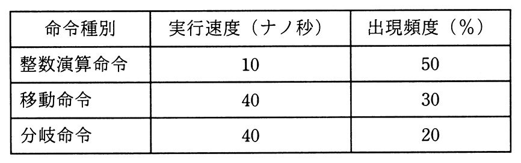

# 令和3年度春期 問9（コンピュータシステム）

## 問題文

表に示す命令ミックスによるコンピュータの処理性能は何MIPSか。

ア　11

イ　25

ウ　40

エ　90

## 使用画像

## 解答と解説

**正解：ウ**

表より，命令種別ごとの実行時間と出現頻度は，整数演算命令が10ナノ秒（50％），移動命令が40ナノ秒（30％），分岐命令が40ナノ秒（20％）である。命令ミックスによる平均命令実行時間は，各命令の実行時間を出現頻度で加重平均して求める。

平均実行時間＝10×0.5＋40×0.3＋40×0.2＝5＋12＋8＝25〔ナノ秒〕

MIPS（1秒間に実行できる命令数を百万単位で表した値）は，1命令当たりの平均実行時間の逆数から求められる。1秒＝10^9ナノ秒なので，

MIPS＝10^9〔ナノ秒〕÷25〔ナノ秒〕÷10^6＝1000÷25＝40〔MIPS〕

したがって正解はウの40である。

**IPA公式：ウ**
