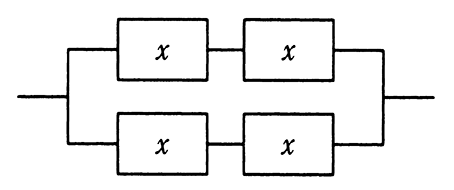
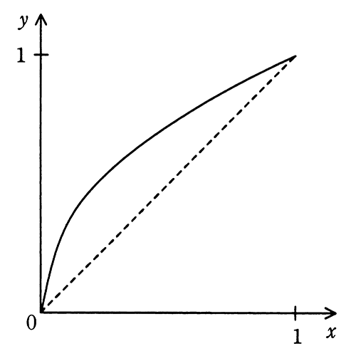
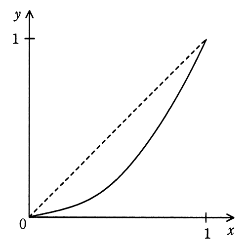
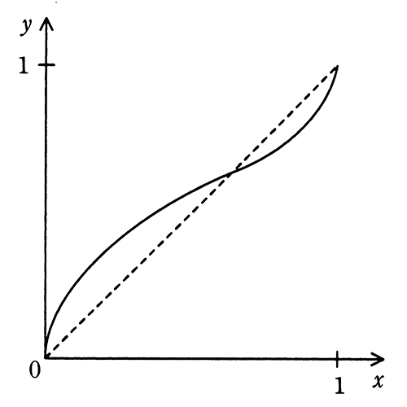
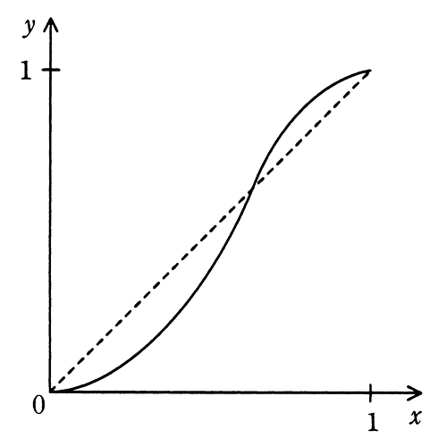

# 令和3年度春期 問14（コンピュータシステム）

## 問題文

稼働率がxである装置を四つ組み合わせて，図のようなシステムを作ったときの稼働率をf(x)とする。区間0≦x≦1におけるy＝f(x)の傾向を表すグラフはどれか。ここで，破線はy＝xのグラフである。

ア　

イ　

ウ　

エ

## 使用画像

## 解答と解説

**正解：エ**

図（AP2021SA014-01.gif）の構成は，稼働率xの装置2台を直列に接続したブロックが，さらに2組並列に接続されたシステムである。

直列接続された2台の稼働率は x×x＝x² である。この直列ブロックを2組並列に接続した場合，システム全体が停止するのは両方のブロックが同時に停止したときだけなので，システムの稼働率は

f(x)＝1－(1－x²)²＝2x²－x⁴

となる。ここでf(x)とy＝xの大小関係を調べると，g(x)＝f(x)－x＝－x(x－1)(x²＋x－1) と因数分解できる。0＜x＜1の範囲では－x(x－1)は常に正なので，g(x)の符号は(x²＋x－1)の符号で決まる。x²＋x－1＝0の解は x＝(－1＋√5)／2≒0.618（黄金比の逆数）であり，

- 0＜x＜0.618 の範囲では x²＋x－1＜0 なので g(x)＜0，すなわち f(x)＜x（曲線は対角線より下側）
- 0.618＜x＜1 の範囲では x²＋x－1＞0 なので g(x)＞0，すなわち f(x)＞x（曲線は対角線より上側）

つまりy＝f(x)のグラフは，原点付近では直線y＝xより下側を通り，x≒0.618付近で交差し，x＝1に近づくにつれて直線y＝xより上側に転じて(1,1)で一致する、対角線を1回だけ横切るS字型の曲線となる。実際に数値で確認すると，x＝0.3のときf(0.3)＝0.1719（＜0.3，下側），x＝0.8のときf(0.8)＝0.8704（＞0.8，上側）となり，この挙動と一致する。

この「下側から上側へ切り替わるS字曲線」に該当するのがエの図（AP2021SA014-05.gif）である。他のグラフのうち，ウ（AP2021SA014-04.gif）は逆に「上側から下側へ」切り替わるS字曲線であり符号が逆、アは常に上側（対角線と交わらない凹型）、イは常に下側（凸型）であり、いずれも実際の挙動とは一致しない。

**IPA公式：エ**
