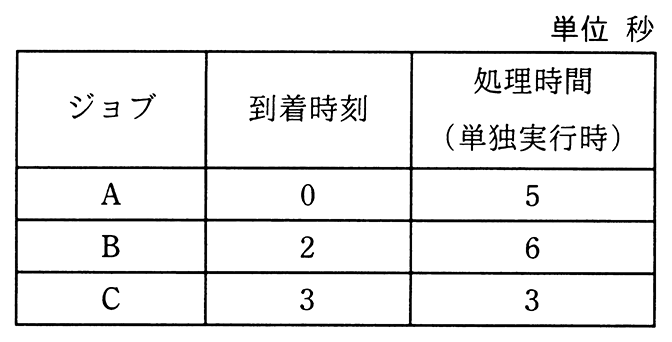

# 令和3年度春期 問16（コンピュータシステム）

## 問題文

ジョブの多重度が1で，到着順にジョブが実行されるシステムにおいて，表に示す状態のジョブA〜Cを処理するとき，ジョブCが到着してから実行が終了するまでのターンアラウンドタイムは何秒か。ここで，OSのオーバヘッドは考慮しない。

ア　11

イ　12

ウ　13

エ　14

## 使用画像

## 解答と解説

**正解：ア**

多重度1（1度に1つのジョブしか実行できない）で到着順（FCFS）にジョブを処理する場合のタイムラインを整理する。

- ジョブAは時刻0に到着し，単独実行時間5秒なので，0〜5秒で実行される。
- ジョブBは時刻2に到着するが，Aの実行中（〜5秒）は待たされ，Aの終了後の5秒から実行を開始し，処理時間6秒なので5〜11秒で実行される。
- ジョブCは時刻3に到着するが，A・Bの実行が終わる11秒まで待たされ，11秒から実行を開始し，処理時間3秒なので11〜14秒で終了する。

ターンアラウンドタイムは「到着してから実行が終了するまでの時間」なので，ジョブCについては，終了時刻14秒－到着時刻3秒＝11秒となる。

したがって正解はアの11である。

**IPA公式：ア**
