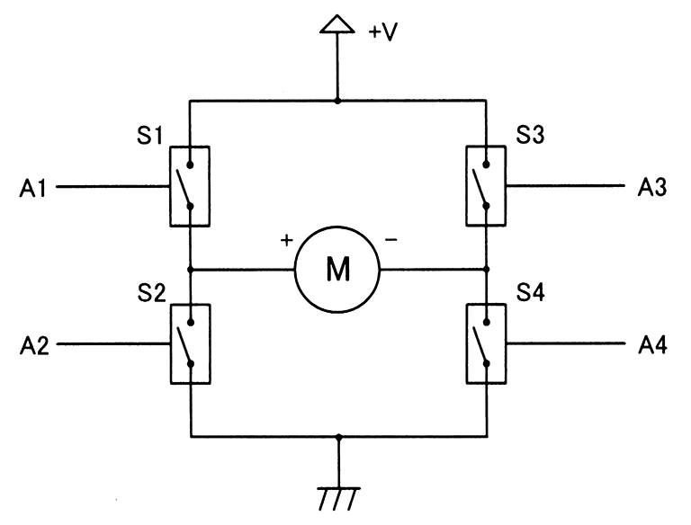
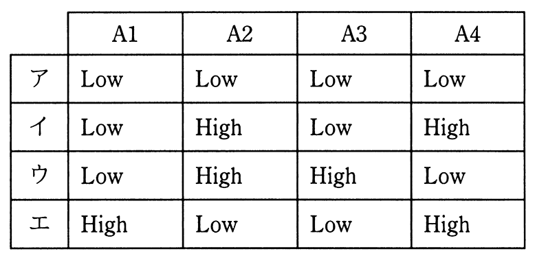

# 令和3年度春期 問23（コンピュータシステム）

## 問題文

図はDCモータの正転逆転制御の動作原理を示す回路である。A1からA4の四つの制御信号の組合せの中で，モータが逆転するものはどれか。ここで，モータの＋端子から−端子に電流が流れるときモータは正転し，S1からS4のそれぞれのスイッチ素子は，対応するA1からA4の制御信号がそれぞれHighのとき導通するものとする。

## 使用画像

## 解答と解説

**正解：ウ**

回路図より、S1・S3は電源（+V）側、S2・S4はグランド（GND）側に接続されており、モータの＋端子側にはS1（電源側）とS2（グランド側）が、－端子側にはS3（電源側）とS4（グランド側）が接続されている。

モータが正転するのは、＋端子から－端子へ電流が流れる場合であり、これはS1（＋端子を電源に接続）とS4（－端子をグランドに接続）を導通させたとき（A1=High, A4=High、A2=A3=Low）に成立する。

逆転させるには電流の向きを逆にすればよいので、－端子側を電源に、＋端子側をグランドに接続する必要がある。すなわちS3（－端子を電源に接続）とS2（＋端子をグランドに接続）を導通させる、つまりA3=High、A2=Highとし、A1=Low、A4=Lowとする組合せが逆転となる。

選択肢ウは A1=Low, A2=High, A3=High, A4=Low であり、この条件に一致する。

- ア（全てLow）：どのスイッチも導通せず、モータは停止する。
- イ（A1=Low, A2=High, A3=Low, A4=High）：＋端子・－端子ともにグランド側に接続され、電流が流れない。
- エ（A1=High, A2=Low, A3=Low, A4=High）：＋端子が電源、－端子がグランドとなり、正転の組合せである。

したがって、モータが逆転する組合せはウである。

**IPA公式：ウ**
