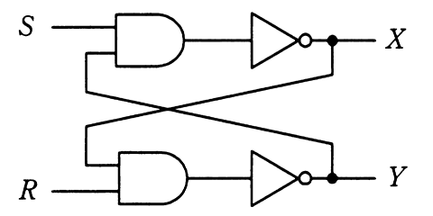

# 令和3年度春期 問25（コンピュータシステム）

## 問題文

図の論理回路において，S＝1，R＝1，X＝0，Y＝1のとき，Sを一旦0にした後，再び1に戻した。この操作を行った後のX，Yの値はどれか。

ア　X＝0，Y＝0

イ　X＝0，Y＝1

ウ　X＝1，Y＝0

エ　X＝1，Y＝1

## 使用画像

## 解答と解説

**正解：ウ**

図の回路は、S・Yを入力とするAND回路の出力をNOT（否定）してXを出力し、R・Xを入力とするAND回路の出力をNOTしてYを出力する、クロス結合されたRS型ラッチ回路である。

初期状態：S＝1，R＝1，X＝0，Y＝1

1. Sを0にする（セット操作）
   - AND(S=0, Y=1)=0 → NOT(0)=1 → X＝1 に変化
   - X＝1となったため、AND(R=1, X=1)=1 → NOT(1)=0 → Y＝0 に変化
   - 再度Xを確認：AND(S=0, Y=0)=0 → NOT(0)=1 → X＝1（変化なし、安定）
   - この時点でX＝1，Y＝0

2. Sを再び1に戻す
   - AND(S=1, Y=0)=0 → NOT(0)=1 → X＝1（変化なし）
   - 状態はホールドされ、X＝1，Y＝0のまま変化しない

したがって、操作後の値はX＝1，Y＝0となり、ウが正しい。

**IPA公式：ウ**
