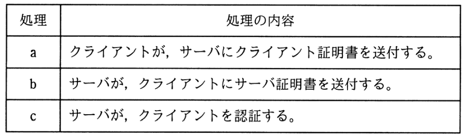

# 令和3年度春期 問45（技術要素）

## 問題文

TLSのクライアント認証における次の処理a〜cについて，適切な順序はどれか。

ア　a → b → c

イ　a → c → b

ウ　b → a → c

エ　c → a → b

## 使用画像

## 解答と解説

**正解：ウ**

TLSのクライアント認証（相互認証）では、まずサーバがクライアントに対して自身を証明する必要があるため、b「サーバがクライアントにサーバ証明書を送付する」が最初に行われる。次にクライアントがサーバへ自身の証明書を送る a「クライアントが、サーバにクライアント証明書を送付する」が続く。最後にサーバが受け取ったクライアント証明書を検証してクライアントを認証する c「サーバが、クライアントを認証する」で完了する。

したがって順序は b → a → c となり、選択肢ウが正しい。TLSハンドシェイクでは、まずサーバの正当性が証明され（ServerCertificate等）、続いてクライアント証明書要求に応じてクライアントが証明書を提示し（ClientCertificate）、最後にサーバ側でその証明書とクライアントの署名を検証して認証を完了するという流れに対応している。

**IPA公式：ウ**

