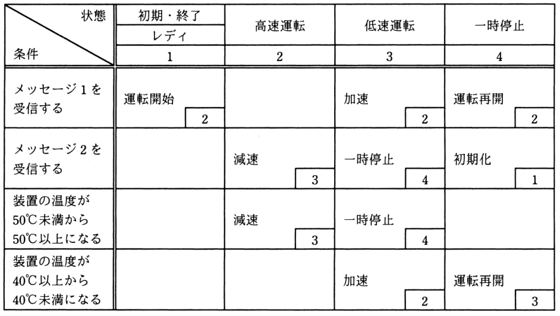

# 令和3年度春期 問47（開発技術）

## 問題文

状態遷移表のとおりに動作し，運転状況に応じて装置の温度が上下するシステムがある。システムの状態が“レディ”のとき，①～⑥の順にイベントが発生すると，最後の状態はどれになるか。ここで，状態遷移表の空欄は状態が変化しないことを表す。

〔状態遷移表〕

〔発生するイベント〕

①　メッセージ1を受信する。

②　メッセージ1を受信する。

③　装置の温度が50℃以上になる。

④　メッセージ2を受信する。

⑤　装置の温度が40℃未満になる。

⑥　メッセージ2を受信する。

ア　レディ

イ　高速運転

ウ　低速運転

エ　一時停止

## 使用画像

