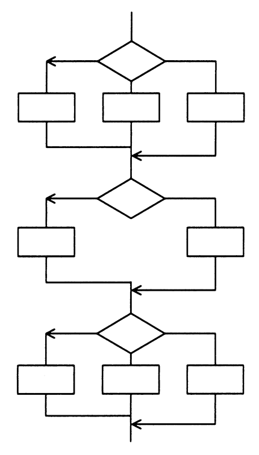

# 令和3年度春期 問48（開発技術）

## 問題文

あるプログラムについて，流れ図で示される部分に関するテストを，命令網羅で実施する場合，最小のテストケース数は幾つか。ここで，各判定条件は流れ図に示された部分の先行する命令の結果から影響を受けないものとする。

ア　3

イ　6

ウ　8

エ　18

## 使用画像

## 解答と解説

**正解：ア**

命令網羅（ステートメントカバレッジ）は、プログラム中の全ての命令（分岐先の処理ブロック）を少なくとも1回は実行するようにテストケースを設定する基準である。分岐条件の全ての組合せを網羅する必要はなく、各分岐先の処理経路を最低1回通過すればよい。

図の流れ図は3段構成で、1段目は3方向分岐（3つの処理ブロック）、2段目・3段目はそれぞれ2方向分岐（2つの処理ブロック）と3方向分岐となっている。各段の分岐先をすべて1回ずつ通す最小のテストケース数を考えると、各段の分岐数のうち最大値（3方向分岐がある段）に合わせてテストケースを組み合わせることで、3つのテストケースで全命令を網羅できる。したがって最小のテストケース数は3となる。

判定条件網羅（分岐の真偽組合せを全て網羅）であれば、より多くのケースが必要になるが、本問は命令網羅なので少ないケース数で足りる点がポイントである。

**IPA公式：ア**

