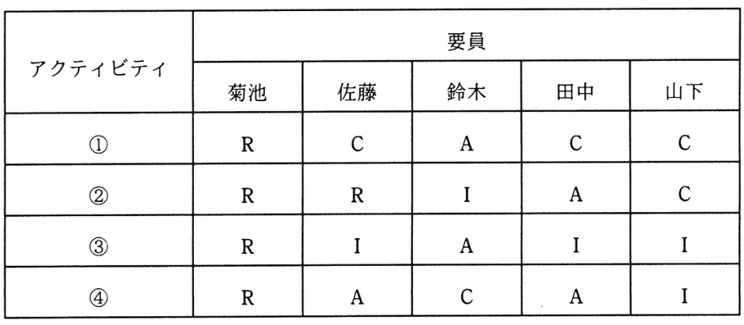

# 令和3年度春期 問52（マネジメント）

## 問題文

表は，RACIチャートを用いた，ある組織の責任分担マトリックスである。条件を満たすように責任分担を見直すとき，適切なものはどれか。

〔条件〕

・各アクティビティにおいて，実行責任者は1人以上とする。

・各アクティビティにおいて，説明責任者は1人とする。

ア　アクティビティ①の菊池の責任をIに変更

イ　アクティビティ②の佐藤の責任をAに変更

ウ　アクティビティ③の鈴木の責任をCに変更

エ　アクティビティ④の田中の責任をRに変更

## 使用画像

## 解答と解説

**正解：エ**

RACIチャートのR（実行責任者）は1人以上、A（説明責任者）は1人という条件で、各アクティビティを確認する。

- ①：R=菊池（1人）、A=鈴木（1人）→条件を満たす
- ②：R=菊池・佐藤（2人）、A=田中（1人）→条件を満たす
- ③：R=菊池（1人）、A=鈴木（1人）→条件を満たす
- ④：R=菊池（1人）、A=佐藤・田中（2人）→説明責任者が2人存在し、条件（Aは1人）に違反している

条件に違反しているのはアクティビティ④のみであり、これを解消するには、Aが重複している佐藤・田中のどちらかの責任を変更する必要がある。選択肢エのとおり、田中の責任をAからRに変更すれば、Aは佐藤のみの1人となり、Rは菊池・田中の2人（1人以上の条件も満たす）となって条件を満たすようになる。

他の選択肢（ア・イ・ウ）は、いずれも既に条件を満たしているアクティビティ①～③に変更を加えるものであり、変更後にRが0人になったりAが増えたりして、かえって条件を崩す、あるいは元々問題のない箇所を不必要に変更するものである。

**IPA公式：エ**

