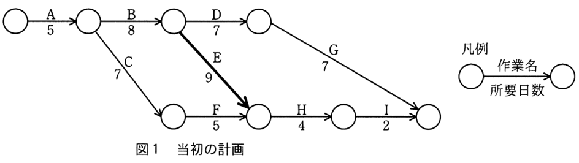
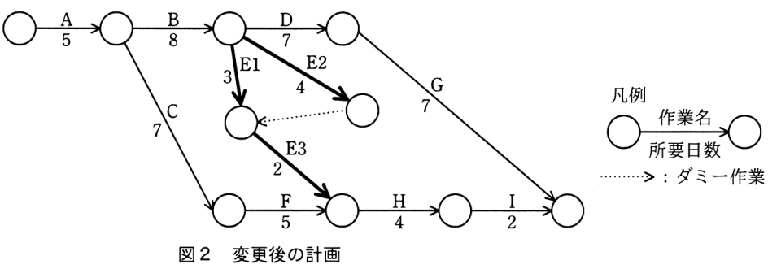

# 令和3年度春期 問53（マネジメント）

## 問題文

プロジェクトのスケジュールを短縮したい。当初の計画は図1のとおりである。作業Eを作業E1，E2，E3に分けて，図2のとおりに計画を変更すると，スケジュールは全体で何日短縮できるか。

ア　1

イ　2

ウ　3

エ　4

## 使用画像

## 解答と解説

**正解：ア**

まず図1（当初計画）の各経路の所要日数を求める。

- A→B→D→G：5+8+7+7＝27日
- A→B→E→H→I：5+8+9+4+2＝28日
- A→C→F→H→I：5+7+5+4+2＝23日

最長経路（クリティカルパス）はA→B→E→H→Iの28日であり、当初の全体所要日数は28日となる。

次に図2（変更後計画）では、作業Eを並行して実施できるE1・E2・E3に分割している。この分割によって、これまでE（9日）がボトルネックとなっていた経路の所要日数が短縮され、E系列を経由する経路はもはや最長経路ではなくなる。その結果、A→B→D→G（5+8+7+7＝27日）が新たな最長経路（クリティカルパス）となり、全体の所要日数は28日から27日に短縮される。

したがって、短縮できる日数は28－27＝1日であり、選択肢アが正しい。

**IPA公式：ア**

