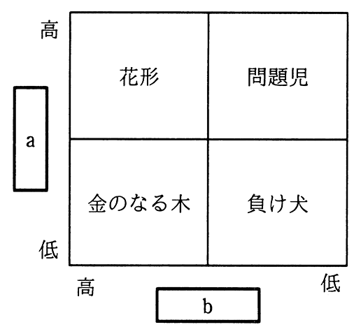
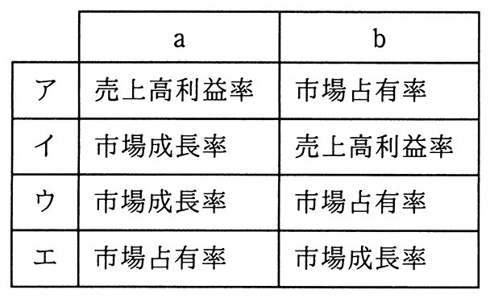

# 令和3年度春期 問67（ストラテジ）

## 問題文

プロダクトポートフォリオマネジメント（PPM）マトリックスのa，bに入れる語句の適切な組合せはどれか。

## 使用画像

## 解答と解説

**正解：ウ**

問題のPPM（プロダクトポートフォリオマネジメント）マトリックスは、縦軸a・横軸bの高低によって「花形」「問題児」「金のなる木」「負け犬」の4象限に製品・事業を分類するフレームワークである。

- 縦軸（a）は「市場成長率」：市場が今後どれだけ伸びるかを表す
- 横軸（b）は「市場占有率（相対market share）」：現在の市場での競争優位性を表す

市場成長率・占有率がともに高い「花形」、成長率は高いが占有率が低い「問題児」、成長率は低いが占有率が高い「金のなる木」、両方低い「負け犬」という配置は、縦軸を市場成長率、横軸を市場占有率とする標準的なPPMマトリックスと一致する。選択肢表と照合すると、a＝市場成長率、b＝市場占有率の組合せはウであり、これが正解となる。

ア・イは縦軸に「売上高利益率」を当てており誤り、エは横軸・縦軸が入れ替わっており誤りである。

**IPA公式：ウ**
