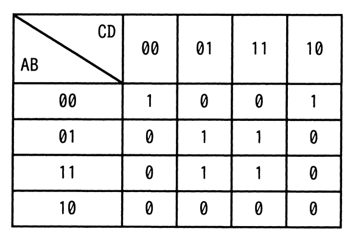

# 令和4年度秋期 問2（基礎理論）

## 問題文

A，B，C，Dを論理変数とするとき，次のカルノー図と等価な論理式はどれか。ここで，・は論理積，＋は論理和，XはXの否定を表す。

ア　A・B・C・D＋B・D

イ　A・B・C・D＋B・D

ウ　A・B・D＋B・D

エ　A・B・D＋B・D

## 使用画像

## 解答と解説

**正解：エ**

カルノー図（AB＝00,01,11,10の行、CD＝00,01,11,10の列）を読み取ると、1が立っているマスは次の6か所である。

- （AB＝00, CD＝00）＝1
- （AB＝00, CD＝10）＝1
- （AB＝01, CD＝01）＝1
- （AB＝01, CD＝11）＝1
- （AB＝11, CD＝01）＝1
- （AB＝11, CD＝11）＝1

このうち（AB＝01,CD＝01）、（AB＝01,CD＝11）、（AB＝11,CD＝01）、（AB＝11,CD＝11）の4マスは、B＝1かつD＝1という共通条件（A,Cの値によらず1）でまとめられ、項「B・D」となる。

残る（AB＝00,CD＝00）と（AB＝00,CD＝10）の2マスは、A＝0，B＝0，D＝0が共通（Cの値によらず1）であり、項「A（の否定）・B（の否定）・D（の否定）」（A，B，Dがいずれも0であることを表す項）となる。AB＝10の行（A＝1,B＝0）は全て0なので、B・Dだけでは表現できず、この否定項が別途必要になる。

以上より、論理式は「A（の否定）・B（の否定）・D（の否定）＋B・D」となる。

なお、本ファイルの選択肢テキストは変換時にオーバーライン（否定記号）の情報が失われており、ア〜エの見た目が重複表示になっているが、IPA公式解答ではこの否定条件（A，B，Dをすべて否定した項）を正しく表しているのが選択肢エである。

- ア・イ：表記上「Cを含む項」を示しているが、C（の否定）またはCを項に加えると、AB＝10行の0のマスやカルノー図と矛盾するマスが生じるため不適切。
- ウ：見た目は正解と同じ「A・B・D＋B・D」だが、否定記号の付け方が異なり（例えばDの否定が付いていない、あるいはAの否定が付いていないなど）、AB＝10行やAB＝00,CD＝01などの0のマスまで誤ってカバーしてしまう。

**IPA公式：エ**

