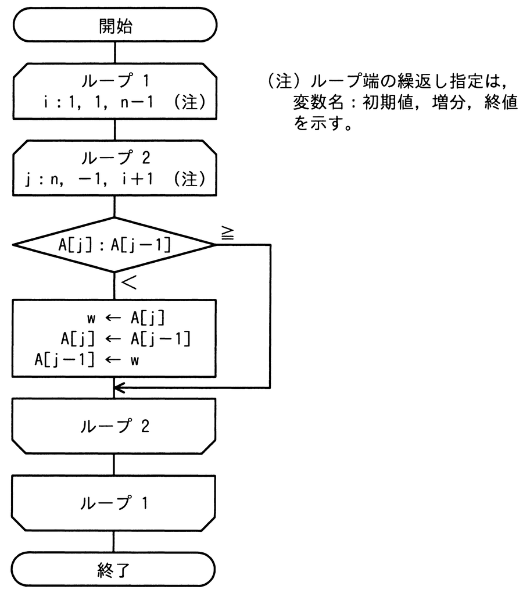

# 令和4年度秋期 問6（基礎理論）

## 問題文

未整列の配列A[i]（i＝1，2，…，n）を，次の流れ図によって整列する。ここで用いられる整列アルゴリズムはどれか。

ア　クイックソート

イ　選択ソート

ウ　挿入ソート

エ　バブルソート

## 使用画像

## 解答と解説

**正解：エ**

流れ図は、外側ループ1（i：1,1,n−1）の中に内側ループ2（j：n,−1,i＋1、すなわちjをnからi＋1まで1ずつ減らす）があり、内側ループの中でA[j]とA[j−1]を比較し、A[j] ＜ A[j−1]（すなわち隣接要素の大小が逆転している）ならば2つの要素を交換する、という処理を繰り返している。

これは配列の末尾側から先頭側に向かって隣り合う2要素を順次比較・交換していく処理を、iを1つずつ増やしながら繰り返す構造であり、隣接要素の比較・交換を繰り返して小さい（または大きい）値を端まで送り出していく典型的な「バブルソート」のアルゴリズムである。

- ア（クイックソート）：基準値（ピボット）を用いた分割統治法であり、隣接要素の単純な比較・交換の繰り返しという構造とは異なる。
- イ（選択ソート）：未整列部分から最小（または最大）値を選んで先頭と交換する方式であり、隣接要素同士の逐次比較ではない。
- ウ（挿入ソート）：整列済み部分に新しい要素を適切な位置に挿入していく方式であり、この流れ図の二重ループ構造とは異なる。

**IPA公式：エ**

