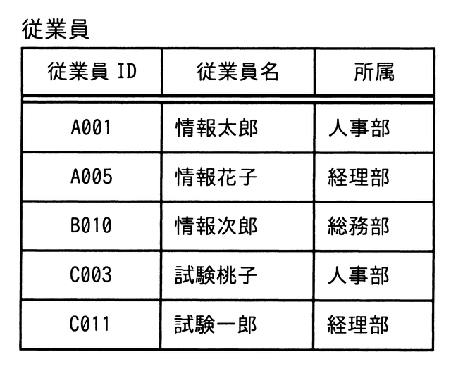
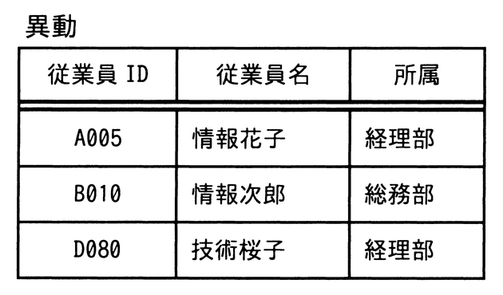
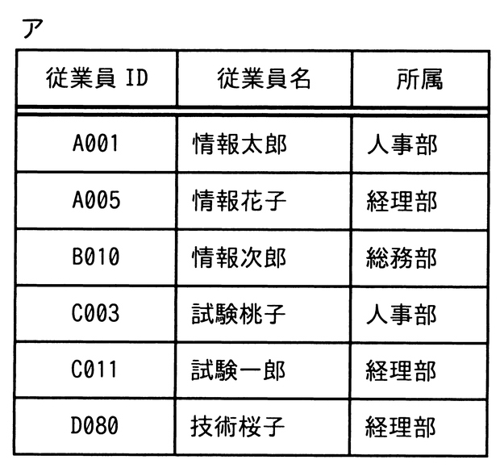
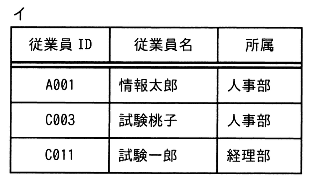
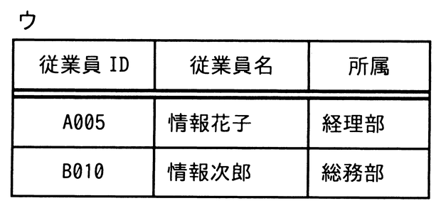
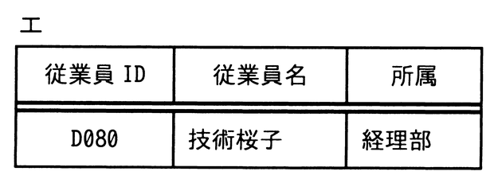

# 令和4年度秋期 問27（技術要素）

## 問題文

“従業員”表に対して“異動”表による差集合演算を行った結果はどれか。

## 使用画像

## 解答と解説

**正解：イ**

差集合演算（従業員 − 異動）は、"従業員"表に含まれる行のうち、"異動"表に存在する行（同一の従業員ID・従業員名・所属をもつ行）を取り除いた結果を求める演算である。

"従業員"表は次の5件。
A001（情報太郎・人事部）、A005（情報花子・経理部）、B010（情報次郎・総務部）、C003（試験桃子・人事部）、C011（試験一郎・経理部）

"異動"表には A005、B010、D080 が含まれるが、このうち"従業員"表にも存在するA005とB010を除外する（D080は元々"従業員"表に存在しないため除外対象にならない）。

結果として残るのは、A001（情報太郎・人事部）、C003（試験桃子・人事部）、C011（試験一郎・経理部）の3件であり、これは選択肢イの内容と一致する。

**IPA公式：イ**

