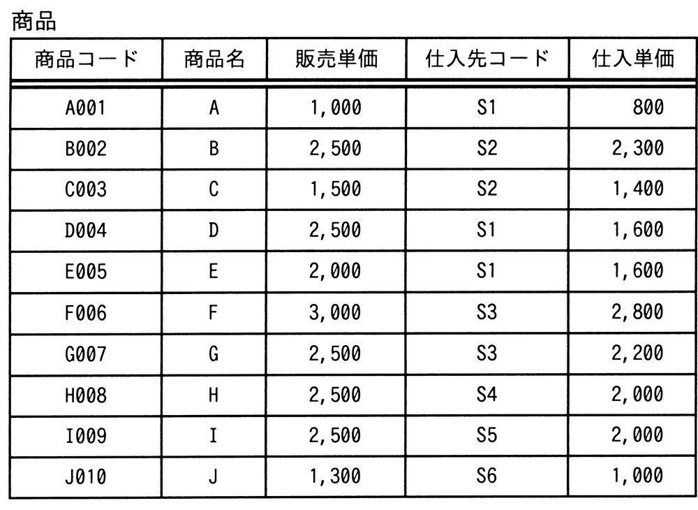

# 令和4年度秋期 問28（技術要素）

## 問題文

“商品”表に対して，次のSQL文を実行して得られる仕入先コード数は幾つか。

〔SQL文〕

SELECT DISTINCT 仕入先コード FROM 商品

　WHERE (販売単価 - 仕入単価) >

　　　　　　(SELECT AVG (販売単価 - 仕入単価) FROM 商品)

ア　1

イ　2

ウ　3

エ　4

## 使用画像

