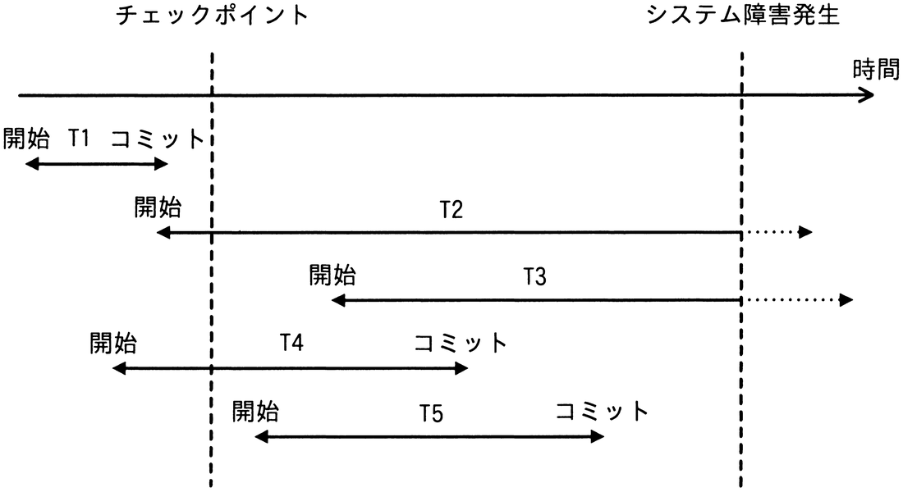

# 令和4年度秋期 問29（技術要素）

## 問題文

チェックポイントを取得するDBMSにおいて，図のような時間経過でシステム障害が発生した。前進復帰（ロールフォワード）によって障害回復できるトランザクションだけを全て挙げたものはどれか。

ア　T1

イ　T2とT3

ウ　T4とT5

エ　T5

## 使用画像

## 解答と解説

**正解：ウ**

前進復帰（ロールフォワード）は、チェックポイント取得後にコミットが完了しているトランザクションに対して適用される障害回復手法である。チェックポイント時点のログを基に、コミット済みの更新内容をログを使って再現（やり直し＝REDO）する。

図の各トランザクションの状態は次のとおり。
- T1：チェックポイント前に開始・コミットが完了（チェックポイント取得時点で既にディスクに反映済みのため回復操作は不要）
- T2：チェックポイントをまたいで実行中のまま障害発生（未コミット）→ロールバック（後退復帰）の対象
- T3：チェックポイントをまたいで実行中のまま障害発生（未コミット）→ロールバック（後退復帰）の対象
- T4：チェックポイント前後にまたがるが、障害発生前にコミット済み→前進復帰（ロールフォワード）の対象
- T5：チェックポイント後に開始し、障害発生前にコミット済み→前進復帰（ロールフォワード）の対象

したがって、前進復帰によって回復できるトランザクションはT4とT5であり、正解はウである。

**IPA公式：ウ**

