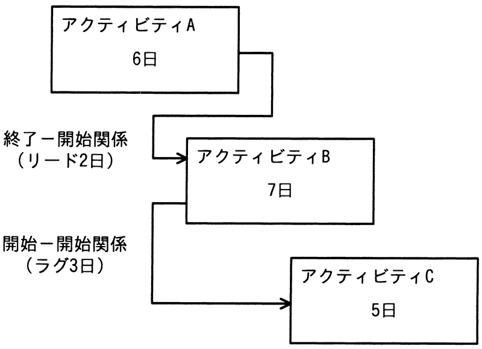

# 令和4年度秋期 問52（マネジメント）

## 問題文

図は，実施する三つのアクティビティについて，プレシデンスダイアグラム法を用いて，依存関係及び必要な作業日数を示したものである。全ての作業を完了するための所要日数は最少で何日か。

ア　11

イ　12

ウ　13

エ　14

## 使用画像

## 解答と解説

**正解：イ**

図の依存関係は次のとおりである。

- アクティビティA（6日）→アクティビティB（7日）：終了−開始関係、リード2日。リードは前工程の終了より前に後工程を開始できることを意味するため、Bの開始日はAの終了日（6日目）より2日早い4日目となる。よってBは4日目に開始し、7日間で11日目に終了する。
- アクティビティB→アクティビティC（5日）：開始−開始関係、ラグ3日。ラグは前工程の開始から一定期間後に後工程を開始することを意味するため、Cの開始日はBの開始日（4日目）から3日後の7日目となる。よってCは7日目に開始し、5日間で12日目に終了する。

全作業の完了日は、B完了（11日目）とC完了（12日目）のうち遅い方であるため、所要日数は最少で12日となる。よってイが正しい。

**IPA公式：イ**
