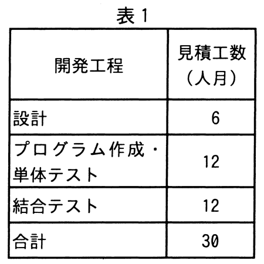
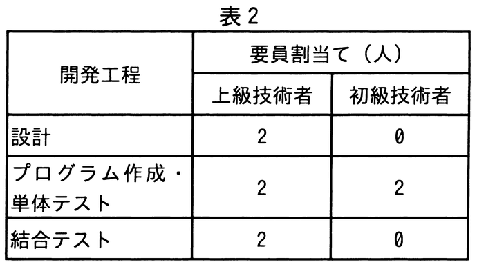

# 令和4年度秋期 問53（マネジメント）

## 問題文

あるシステムの設計から結合テストまでの作業について，開発工程ごとの見積工数を表1に，開発工程ごとの上級技術者と初級技術者との要員割当てを表2に示す。上級技術者は，初級技術者に比べて，プログラム作成・単体テストにおいて2倍の生産性を有する。表1の見積工数は，上級技術者の生産性を基に算出している。

　全ての開発工程に対して，上級技術者を1人追加して割り当てると，この作業に要する期間は何か月短縮できるか。ここで，開発工程の期間は重複させないものとし，要員全員が1か月当たり1人月の工数を投入するものとする。

　

ア　1

イ　2

ウ　3

エ　4

## 使用画像

## 解答と解説

**正解：エ**

表2より、追加前の要員配置は、設計：上級2人、プログラム作成・単体テスト：上級2人＋初級2人、結合テスト：上級2人である。上級技術者は初級技術者の2倍の生産性を持ち、表1の見積工数は上級技術者基準（人月）である。

設計工程の期間＝6人月÷2人（上級のみ）＝3か月
プログラム作成・単体テスト工程の期間：上級2人分＋初級2人分（生産性0.5倍換算で1人分相当）＝合計3人分の実効能力なので、12人月÷3＝4か月
結合テスト工程の期間＝12人月÷2人（上級のみ）＝6か月
（工程は重複させないため）合計期間＝3＋4＋6＝13か月

各工程に上級技術者を1人追加すると、
設計＝6÷3人（上級3人）＝2か月
プログラム作成・単体テスト＝12÷（上級3人＋初級2人×0.5＝実効4人）＝3か月
結合テスト＝12÷3人（上級3人）＝4か月
合計＝2＋3＋4＝9か月

短縮期間＝13か月－9か月＝4か月となる。よってエが正しい。

**IPA公式：エ**
