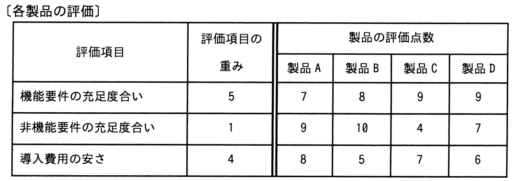

# 令和4年度秋期 問54（マネジメント）

## 問題文

あるシステム導入プロジェクトで，調達候補のパッケージ製品を多基準意思決定分析の加重総和法を用いて評価する。製品A〜製品Dのうち，総合評価が最も高い製品はどれか。ここで，評価点数の値が大きいほど，製品の評価は高い。

ア　製品A

イ　製品B

ウ　製品C

エ　製品D

## 使用画像

## 解答と解説

**正解：ウ**

加重総和法では、各評価項目の評価点数に重みを掛けて合計し、総合評価点を求める。図の重みと評価点数から各製品の総合評価点を計算すると次のとおりである。

- 製品A：機能要件 7×5＋非機能要件 9×1＋導入費用 8×4＝35＋9＋32＝76点
- 製品B：8×5＋10×1＋5×4＝40＋10＋20＝70点
- 製品C：9×5＋4×1＋7×4＝45＋4＋28＝77点
- 製品D：9×5＋7×1＋6×4＝45＋7＋24＝76点

計算の結果、製品Cが77点で最も総合評価が高い。よってウが正しい（製品A・Dは76点で僅差の次点、製品Bは70点で最も低い）。

**IPA公式：ウ**
