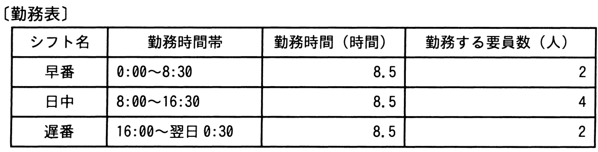

# 令和4年度秋期 問56（マネジメント）

## 問題文

あるサービスデスクでは，年中無休でサービスを提供している。要員は勤務表及び勤務条件に従って1日3交替のシフト制で勤務している。1週間のサービス提供で必要な要員は，少なくとも何人か。

〔勤務条件〕

　・勤務を交替するときに30分間で引継ぎを行う。

　・1回のシフト中に1時間の休憩を取り，労働時間は7.5時間とする。

　・1週間の労働時間は，40時間以内とする。

ア　8

イ　11

ウ　12

エ　14

## 使用画像

## 解答と解説

**正解：ウ**

勤務表より、1日あたりの必要な要員数（延べシフト数）は、早番2人＋日中4人＋遅番2人＝8シフト分／日である。1週間（7日間）では、8シフト×7日＝56シフト分の勤務が必要となる。

一方、1人の要員が1回のシフトで働く実労働時間は、拘束8.5時間から休憩1時間を除いた7.5時間である。1週間の労働時間の上限は40時間であるため、1人が1週間に担当できるシフト数は、40時間÷7.5時間＝5.33…より、最大5シフトまでとなる（端数は切り捨て）。

したがって、必要な最少要員数は、56シフト分÷1人あたり最大5シフト＝11.2人となり、人数は整数でなければならないため切り上げて12人となる。よってウが正しい。

**IPA公式：ウ**
