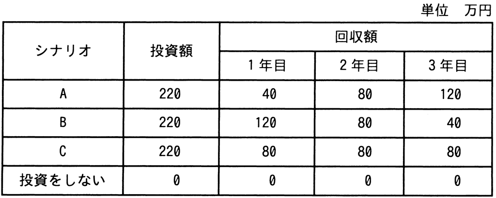

# 令和4年度秋期 問64（ストラテジ）

## 問題文

投資効果を正味現在価値法で評価するとき，最も投資効果が大きい（又は最も損失が小さい）シナリオはどれか。ここで，期間は3年間，割引率は5％とし，各シナリオのキャッシュフローは表のとおりとする。

ア　A

イ　B

ウ　C

エ　投資をしない

## 使用画像

## 解答と解説

**正解：イ**

正味現在価値（NPV）法では、各年のキャッシュフローを割引率で現在価値に割り引いて合計し、そこから投資額を差し引いた値がプラスで大きいほど投資効果が大きいと評価する。割引率5％のとき、各年の現価係数は次のとおりである。

- 1年目：1/1.05 ≈ 0.9524
- 2年目：1/1.05² ≈ 0.9070
- 3年目：1/1.05³ ≈ 0.8638

各シナリオのNPV（回収額の現在価値合計－投資額220）を計算すると次のようになる。

- A：40×0.9524＋80×0.9070＋120×0.8638－220 ≈ 214.3－220 ＝ 約－5.7
- B：120×0.9524＋80×0.9070＋40×0.8638－220 ≈ 221.4－220 ＝ 約＋1.4
- C：80×0.9524＋80×0.9070＋80×0.8638－220 ≈ 217.9－220 ＝ 約－2.1
- 投資をしない：0

回収額の単純合計は各シナリオとも240万円で同じだが、Bは早い年ほど回収額が大きいため割引の影響を受けにくく、唯一NPVがプラス（約1.4万円）となる。これは「投資をしない（0）」を上回る最大の投資効果であり、Bを選ぶイが正解となる。

**IPA公式：イ**

