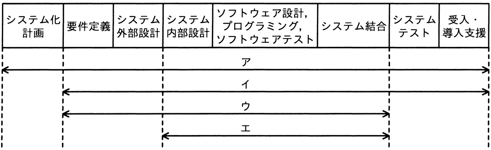

# 令和4年度秋期 問66（ストラテジ）

## 問題文

“情報システム・モデル取引・契約書＜第二版＞”によれば，ウォーターフォールモデルによるシステム開発において，ユーザ（取得者）とベンダ（供給者）間で請負型の契約が適切であるとされるフェーズはどれか。

ア　システム化計画フェーズから受入・導入支援フェーズまで

イ　要件定義フェーズから受入・導入支援フェーズまで

ウ　要件定義フェーズからシステム結合フェーズまで

エ　システム内部設計フェーズからシステム結合フェーズまで

## 使用画像

