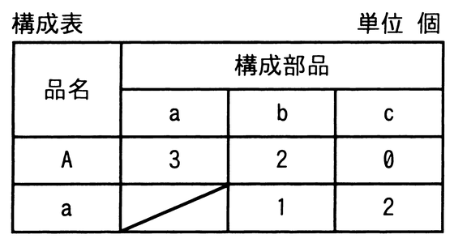
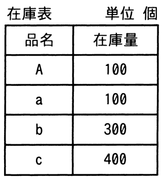

# 令和4年度秋期 問72（ストラテジ）

## 問題文

構成表の製品Aを300個出荷しようとするとき，部品bの正味所要量は何個か。ここで，A，a，b，cの在庫量は在庫表のとおりとする。また，他の仕掛残，注文残，引当残などはないものとする。

　

ア　200

イ　600

ウ　900

エ　1,500

## 使用画像

## 解答と解説

**正解：イ**

構成表より、製品Aは部品aを3個、部品bを2個必要とし、部品aは部品bを1個、部品cを2個必要とする（部品bは製品Aから直接必要になるほか、部品aの生産を通じても必要になる二段階の親子関係になっている）。在庫表は A：100個、a：100個、b：300個、c：400個である。

正味所要量は「総所要量（上位品目の“正味”生産数量から生じる所要量）－在庫量」で求め、上位品目から順に計算する。

1. 製品Aの正味所要量：総所要量300個－在庫100個＝200個（この200個分だけが実際に生産され、下位部品を消費する）
2. 部品aの総所要量：A の正味所要量200個×3＝600個。正味所要量：600－在庫100＝500個
3. 部品bの総所要量：Aの正味所要量200個×2（Aから直接）＋aの正味所要量500個×1（aの生産から）＝400＋500＝900個
4. 部品bの正味所要量：900－在庫300＝600個

したがって部品bの正味所要量は600個であり、イが正解となる。

**IPA公式：イ**

