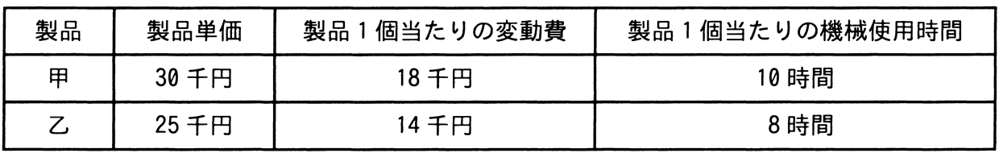

# 令和4年度秋期 問77（ストラテジ）

## 問題文

表の製品甲と乙とを製造販売するとき，年間の最大営業利益は何千円か。ここで，甲と乙の製造には同一の機械が必要であり，機械の年間使用可能時間は延べ10,000時間，年間の固定費総額は10,000千円とする。また，甲と乙の製造に関して，機械の使用時間以外の制約条件はないものとする。

ア　2,000

イ　3,750

ウ　4,750

エ　6,150

## 使用画像

