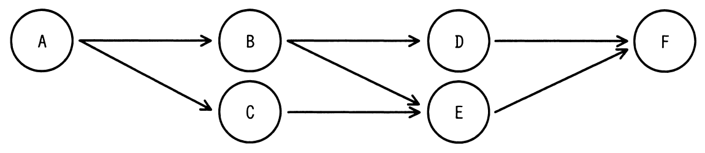
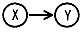
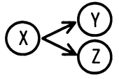
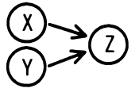

# 令和4年度春期 問16（コンピュータシステム）

## 問題文

ジョブ群と実行の条件が次のとおりであるとき，一時ファイルを作成する磁気ディスクに必要な容量は最低何Mバイトか。

〔ジョブ群〕

〔実行の条件〕

（1）　ジョブの実行多重度を2とする。

（2）　各ジョブの処理時間は同一であり，他のジョブの影響は受けない。

（3）　各ジョブは開始時に50Mバイトの一時ファイルを新たに作成する。

（4）　の関係があれば，ジョブXの開始時に作成した一時ファイルは，直後のジョブYで参照し，ジョブYの終了時にその一時ファイルを削除する。直後のジョブが複数個ある場合には，最初に生起されるジョブだけが先行ジョブの一時ファイルを参照する。

（5）　はジョブXの終了時に，ジョブY，ジョブZのようにジョブXと矢印で結ばれる全てのジョブが，上から記述された順に優先して生起されることを示す。

（6）　は先行するジョブX，Y両方が終了したときにジョブZが生起されることを示す。

（7）　ジョブの生起とは実行待ち行列への追加を意味し，各ジョブは待ち行列の順に実行される。

（8）　OSのオーバヘッドは考慮しない。

ア　100

イ　150

ウ　200

エ　250

## 使用画像

