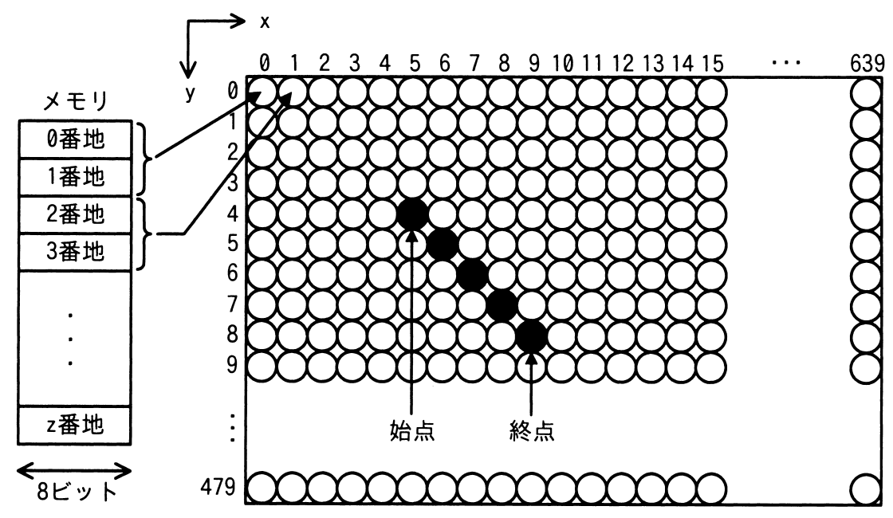

# 令和4年度春期 問21（コンピュータシステム）

## 問題文

次の方式で画素にメモリを割り当てる640×480のグラフィックLCDモジュールがある。始点（5，4）から終点（9，8）まで直線を描画するとき，直線上のx＝7の画素に割り当てられたメモリのアドレスの先頭は何番地か。ここで，画素の座標は（x，y）で表すものとする。

〔方式〕

・メモリは0番地から昇順に使用する。

・1画素は16ビットとする。

・座標（0，0）から座標（639，479）までメモリを連続して割り当てる。

・各画素は，x＝0からX軸の方向にメモリを割り当てていく。

・x＝639の次はx＝0とし，yを1増やす。

ア　3847

イ　7680

ウ　7694

エ　8978

## 使用画像

## 解答と解説

**正解：ウ**

画素は0番地からx方向に昇順で割り当てられ、1画素16ビット（＝2バイト）である。画像より、始点(5,4)と終点(9,8)を結ぶ直線は45度の対角線で、x=5,6,7,8,9のときそれぞれy=4,5,6,7,8となる。したがってx=7のときy=6である。

座標(x,y)の画素は、y行分（1行=640画素）が先に埋まり、その後そのy行内でx番目に位置するので、画素の通し番号（0始まり）は次のようになる。

画素番号 = 640×y + x = 640×6 + 7 = 3840 + 7 = 3847

1画素=2バイトなので、アドレスの先頭番地は

アドレス = 3847 × 2 = 7694

よって正解は7694番地であるウとなる。アの3847は画素番号そのもの（バイト換算前）、イの7680は640×12（xを誤って0とした場合など）に相当し、エの8978は計算を誤った値である。

**IPA公式：ウ**

