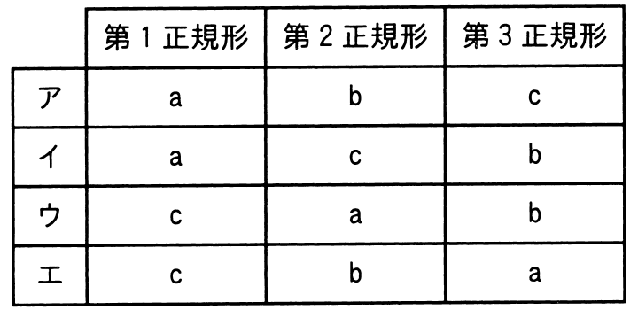

# 令和4年度春期 問28（技術要素）

## 問題文

第1，第2，第3正規形とリレーションの特徴a，b，cの組合せのうち，適切なものはどれか。

a：どの非キー属性も，主キーの真部分集合に対して関数従属しない。

b：どの非キー属性も，主キーに推移的に関数従属しない。

c：繰返し属性が存在しない。

## 使用画像

## 解答と解説

**正解：ウ**

正規化の各段階と特徴a〜cの対応関係を整理すると次のとおりである。

- 第1正規形：繰返し属性（リピーティンググループ）が存在しない状態。これは特徴cに該当する。
- 第2正規形：第1正規形であり、かつどの非キー属性も主キーの真部分集合に対して部分関数従属しない（＝完全関数従属している）状態。これは特徴aに該当する。
- 第3正規形：第2正規形であり、かつどの非キー属性も主キーに推移的に関数従属しない状態。これは特徴bに該当する。

つまり対応は「第1正規形＝c、第2正規形＝a、第3正規形＝b」となる。

画像の選択肢を確認すると、
- ア：第1＝a、第2＝b、第3＝c → 誤り
- イ：第1＝a、第2＝c、第3＝b → 誤り
- ウ：第1＝c、第2＝a、第3＝b → 正しい組合せ
- エ：第1＝c、第2＝b、第3＝a → 誤り

したがって、正解はウである。

**IPA公式：ウ**

