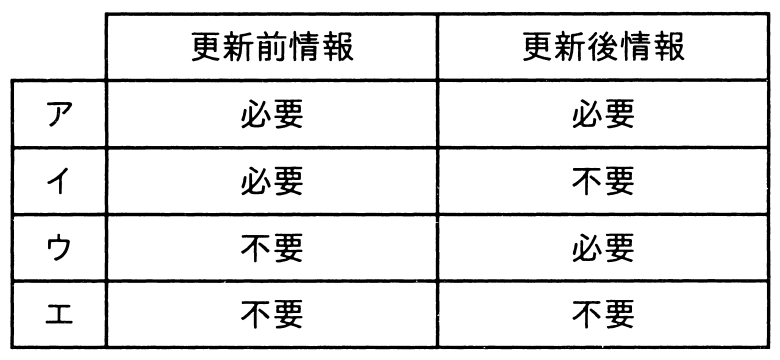

# 令和4年度春期 問29（技術要素）

## 問題文

undo/redo方式を用いた障害回復におけるログ情報の要否として，適切な組合せはどれか。

## 使用画像

## 解答と解説

**正解：ア**

undo/redo方式によるログを用いた障害回復では、トランザクションの更新前情報（undo用）と更新後情報（redo用）の両方をログに記録しておく必要がある。

- undo（取消し）：コミット前に障害が発生した場合、更新前情報を使ってデータを元の状態に戻す。そのため更新前情報が必要。
- redo（やり直し）：コミット済みだがディスクに反映される前に障害が発生した場合、更新後情報を使ってデータを最新の状態に再現する。そのため更新後情報も必要。

つまりundo/redo方式では、更新前情報・更新後情報の両方が必要（＝必要、必要）となる。

画像の選択肢を確認すると、
- ア：更新前情報＝必要、更新後情報＝必要 → undo/redo方式の説明に一致し、正解
- イ：更新前情報＝必要、更新後情報＝不要 → これはundo（のみ）方式（更新前ログ方式）の説明
- ウ：更新前情報＝不要、更新後情報＝必要 → これはredo（のみ）方式（更新後ログ方式）の説明
- エ：更新前情報＝不要、更新後情報＝不要 → ログを使わない方式であり誤り

したがって、正解はアである。

**IPA公式：ア**

