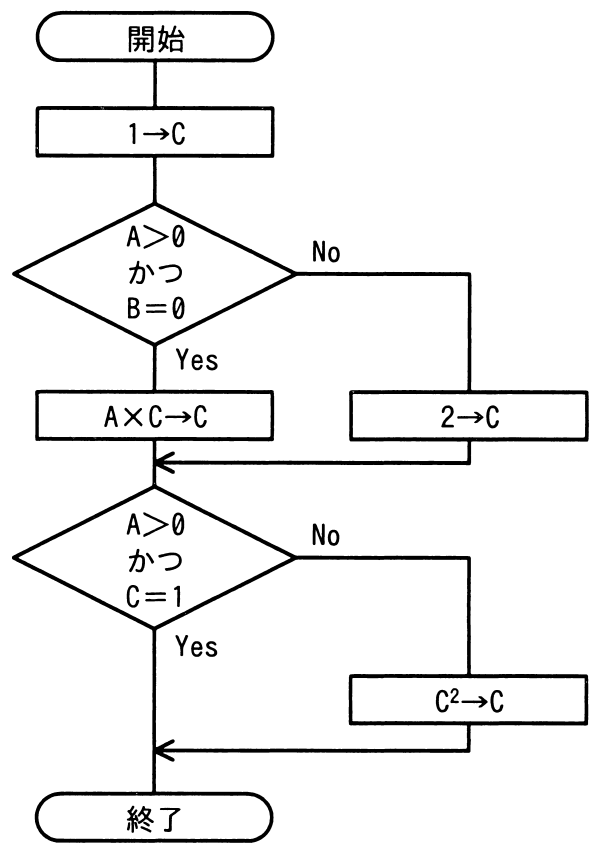

# 令和4年度春期 問47（開発技術）

## 問題文

次の流れ図において，判定条件網羅（分岐網羅）を満たす最少のテストケースの組みはどれか。

ア　（1）　A＝0，B＝0　（2）　A＝1，B＝1

イ　（1）　A＝1，B＝0　（2）　A＝1，B＝1

ウ　（1）　A＝0，B＝0　（2）　A＝1，B＝1　（3）　A＝1，B＝0

エ　（1）　A＝0，B＝0　（2）　A＝0，B＝1　（3）　A＝1，B＝0

## 使用画像

## 解答と解説

**正解：イ**

流れ図には判定条件が2箇所ある。
- 判定1：「A＞0 かつ B＝0」（Yes→A×C→C、No→2→C）
- 判定2：「A＞0 かつ C＝1」（Yes→終了、No→C²→C→終了）

判定条件網羅（分岐網羅）とは、各判定において分岐であるYesとNoの両方を、それぞれ少なくとも1回は実行するようにテストケースを設定する基準である。今回はA、Bの2変数を操作できるので、最少2ケースで両方の判定のYes/Noを網羅できるかを確認する。

選択肢イ「(1) A＝1，B＝0　(2) A＝1，B＝1」で検証する。
(1) A=1, B=0：判定1「A＞0かつB＝0」はYes（1>0かつ0=0）→ A×C＝1×1＝1→C。次に判定2「A＞0かつC＝1」はYes（1>0かつ1=1）→終了。
(2) A=1, B=1：判定1「A＞0かつB＝0」はNo（B=1≠0）→ 2→C（C=2）。次に判定2「A＞0かつC＝1」はNo（C=2≠1）→ C²→C→終了。

この2ケースで、判定1はYes・No両方、判定2もYes・No両方が実行されており、判定条件網羅を満たしている。ケース数も最少の2件であるため、イが正しい。

アの(1)A=0,B=0は判定1がNo（A>0が不成立）、(2)A=1,B=1も判定1がNoとなり、判定1のYesが一度も実行されず網羅できない。ウとエは3ケース構成であり、判定条件網羅は満たすものの最少ケース数ではないため、「最少の組み」という条件に反する。

**IPA公式：イ**

