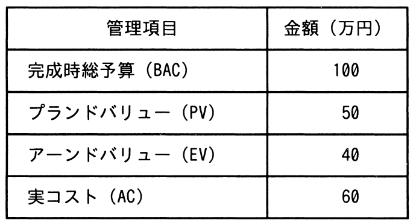

# 令和4年度春期 問51（マネジメント）

## 問題文

ある組織では，プロジェクトのスケジュールとコストの管理にアーンドバリューマネジメントを用いている。期間10日間のプロジェクトの，5日目の終了時点の状況は表のとおりである。この時点でのコスト効率が今後も続くとしたとき，完成時総コスト見積り（EAC）は何万円か。

ア　110

イ　120

ウ　135

エ　150

## 使用画像

