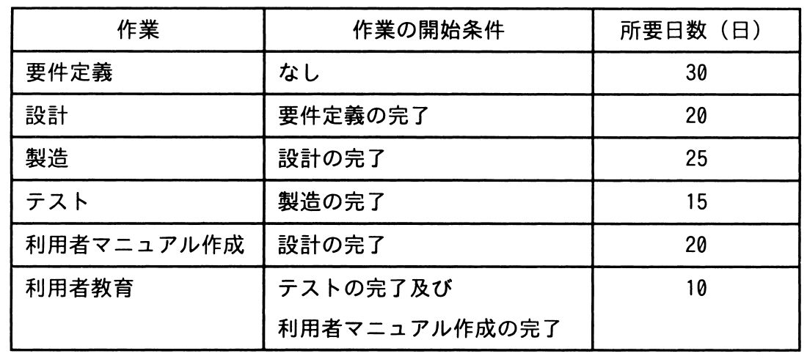

# 令和4年度春期 問53（マネジメント）

## 問題文

ソフトウェア開発プロジェクトにおいて，表の全ての作業を完了させるために必要な期間は最短で何日間か。

ア　80

イ　95

ウ　100

エ　120

## 使用画像

## 解答と解説

**正解：ウ**

表の依存関係から、開始から終了までの経路（ルート）を全て洗い出し、各経路の所要日数を合計する。

経路1：要件定義（30）→ 設計（20）→ 製造（25）→ テスト（15）→ 利用者教育（10）
　＝ 30 + 20 + 25 + 15 + 10 = 100日

経路2：要件定義（30）→ 設計（20）→ 利用者マニュアル作成（20）→ 利用者教育（10）
　＝ 30 + 20 + 20 + 10 = 80日

利用者教育は「テストの完了」と「利用者マニュアル作成の完了」の両方を待つ必要があるため、2つの経路のうち日数の大きい方（クリティカルパス）がプロジェクト全体の所要期間を決定する。

経路1が100日、経路2が80日であり、経路1の方が長いため、これがクリティカルパスとなる。

したがって、全ての作業を完了させるために必要な最短期間は100日間であり、正解は「ウ　100」である。

**IPA公式：ウ**

