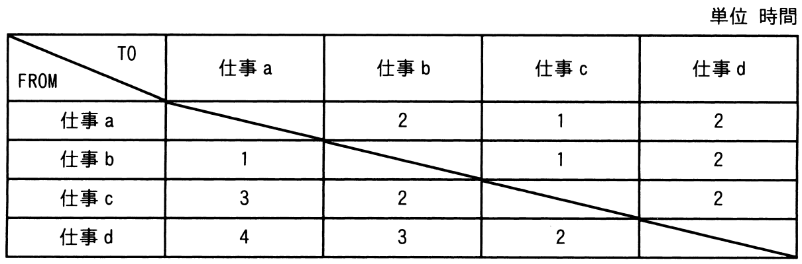

# 令和4年度春期 問73（ストラテジ）

## 問題文

製造業のA社では，NC工作機械を用いて，四つの仕事a〜dを行っている。各仕事間の段取り時間は表のとおりである。合計の段取り時間が最小になるように仕事を行った場合の合計段取り時間は何時間か。ここで，仕事はどの順序で行ってもよく，a〜dを一度ずつ行うものとし，FROMからTOへの段取り時間で検討する。

ア　4

イ　5

ウ　6

エ　7

## 使用画像

## 解答と解説

**正解：ア**

表はFROM（直前に行った仕事）からTO（次に行う仕事）へ切り替える際の段取り時間を示している。4つの仕事a〜dを1回ずつ、どの順序で行ってもよいので、可能な24通りの順列すべてについて、連続する仕事間の段取り時間の合計を計算し、最小値を求める。

表の値は以下のとおり。
- a→b=2, a→c=1, a→d=2
- b→a=1, b→c=1, b→d=2
- c→a=3, c→b=2, c→d=2
- d→a=4, d→b=3, d→c=2

順序「b→a→c→d」で計算すると、b→a（1）＋a→c（1）＋c→d（2）＝4時間となり、これが全24通りの中で最小である（他の組合せは5時間以上となる）。

例えば「a→b→c→d」は 2＋1＋2＝5時間、「a→c→b→d」は 1＋2＋2＝5時間などであり、いずれも4時間を下回らない。

したがって、合計段取り時間が最小になるのは4時間であり、正解はアである。

**IPA公式：ア**

