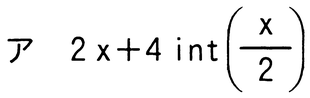
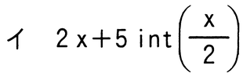
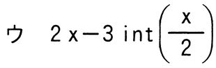
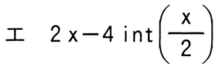

# 令和5年度秋期 問1（基礎理論）

## 問題文

2桁の2進数$x_{1}x_{2}$が表す整数をxとする。2進数$x_{2}x_{1}$が表す整数を，xの式で表したものはどれか。ここで，int（r）は非負の実数rの小数点以下を切り捨てた整数を表す。

## 使用画像

## 解答と解説

**正解：ウ**

2進数x1x2が表す整数xは、x = 2×x1 + x2 と表せる。ここで x1, x2 はそれぞれ0または1のビットである。

x2x1 が表す整数は、2×x2 + x1 となる。この式をxの式で書き換える。

- int(x/2) は x を2で割った商であり、x1 に等しい（x1 は上位ビットなので x/2 の整数部分と一致する）。すなわち x1 = int(x/2)。
- x2 は x の下位ビットなので、x2 = x − 2×int(x/2) = x − 2×x1。

これらを x2x1 = 2×x2 + x1 に代入すると、

2×x2 + x1 = 2×(x − 2×int(x/2)) + int(x/2) = 2x − 4×int(x/2) + int(x/2) = 2x − 3×int(x/2)

したがって、x2x1 = 2x − 3int(x/2) となり、選択肢ウと一致する。

他の選択肢は係数（+4, +5, −4）が誤っており、上記の展開結果と合致しない。

**IPA公式：ウ**

