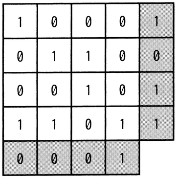

# 令和5年度秋期 問4（基礎理論）

## 問題文

図のように16ビットのデータを4×4の正方形状に並べ，行と列にパリティビットを付加することによって何ビットまでの誤りを訂正できるか。ここで，図の網掛け部分はパリティビットを表す。

ア　1

イ　2

ウ　3

エ　4

## 使用画像

## 解答と解説

**正解：ア**

図は16ビットのデータを4行4列に配置し、各行末と各列末（右端の列と下端の行）にパリティビット（偶数パリティ等の検査ビット）を付加した構成である。これは水平垂直パリティ（2次元パリティ）と呼ばれる誤り検出・訂正方式である。

この方式では、1ビットの誤りが発生すると、そのビットが属する行のパリティと列のパリティの両方が不一致になる。行番号と列番号が特定できるため、誤りが発生したビットの位置を一意に特定でき、そのビットを反転させることで訂正できる。

しかし2ビット以上の誤りが同時に発生すると、パリティの不一致が複数の行・列にまたがって発生し、どの組合せが実際の誤りビットなのかを一意に特定できなくなる（誤り検出はできても訂正はできない、あるいは検出すらできないケースもある）。

したがって、この方式で訂正できるのは1ビットまでであり、選択肢アが正解となる。

**IPA公式：ア**

