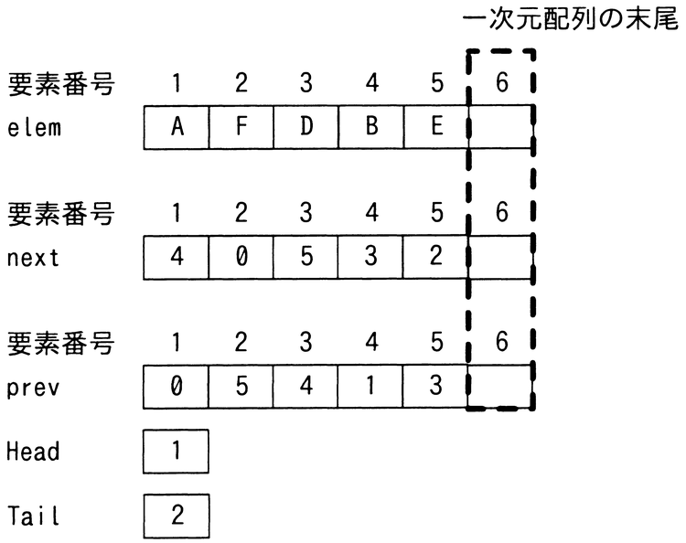
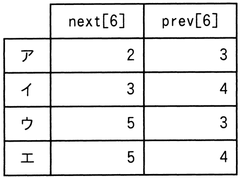

# 令和5年度秋期 問5（基礎理論）

## 問題文

双方向リストを三つの一次元配列elem[i]，next[i]，prev[i]の組で実現する。双方向リストが図の状態のとき，要素Dの次に要素Cを挿入した後のnext[6]，prev[6]の値の組合せはどれか。ここで，双方向リストは次のように表現する。

・双方向リストの要素は，elem[i]に値，next[i]に次の要素の要素番号，prev[i]に前の要素の要素番号を設定

・双方向リストの先頭，末尾の要素番号は，それぞれ変数Head，Tailに設定

・next[i]，prev[i]の値が0である要素は，それぞれ双方向リストの末尾，先頭を表す。

・双方向リストへの要素の追加は，一次元配列の末尾に追加

## 使用画像

## 解答と解説

**正解：ウ**

初期状態の配列は次のとおりである。

- elem: [1]=A, [2]=F, [3]=D, [4]=B, [5]=E
- next: [1]=4, [2]=0, [3]=5, [4]=3, [5]=2
- prev: [1]=0, [2]=5, [3]=4, [4]=1, [5]=3
- Head=1, Tail=2

Headから順にたどると、A(1)→B(4)→D(3)→E(5)→F(2) となり、リストの並びは A, B, D, E, F である。

要素Dの次に要素Cを挿入する。Dの要素番号は3で、Dの次はnext[3]=5すなわちEである。新しい要素Cは配列の末尾（要素番号6）に追加されるため、elem[6]=Cとなる。

挿入後のリストは A, B, D, C, E, F となるべきなので、Cの前（prev）はD（要素番号3）、Cの次（next）はE（要素番号5）である。したがって、

- next[6] = 5（Cの次はE）
- prev[6] = 3（Cの前はD）

この組合せは選択肢ウ（next[6]=5, prev[6]=3）と一致する。なお、D側・E側のnext/prevの更新（next[3]を5→6、prev[5]を3→6にする処理）も本来必要だが、設問はnext[6]とprev[6]の値のみを問うている。

**IPA公式：ウ**

