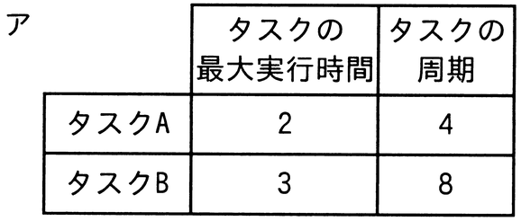
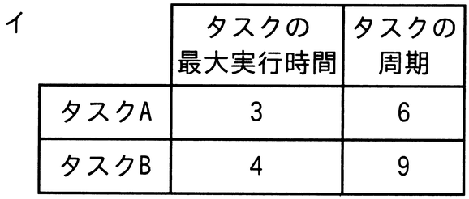

# 令和5年度秋期 問17（コンピュータシステム）

## 問題文

プリエンプティブな優先度ベースのスケジューリングで実行する二つの周期タスクA及びBがある。タスクBが周期内に処理を完了できるタスクA及びBの最大実行時間及び周期の組合せはどれか。ここで，タスクAの方がタスクBより優先度が高く，かつ，タスクAとBの共有資源はなく，タスク切替え時間は考慮しないものとする。また，時間及び周期の単位はミリ秒とする。

## 使用画像

