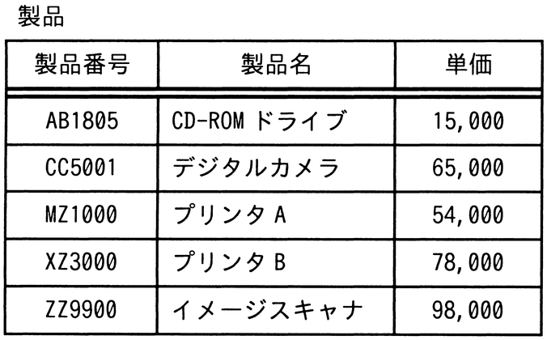
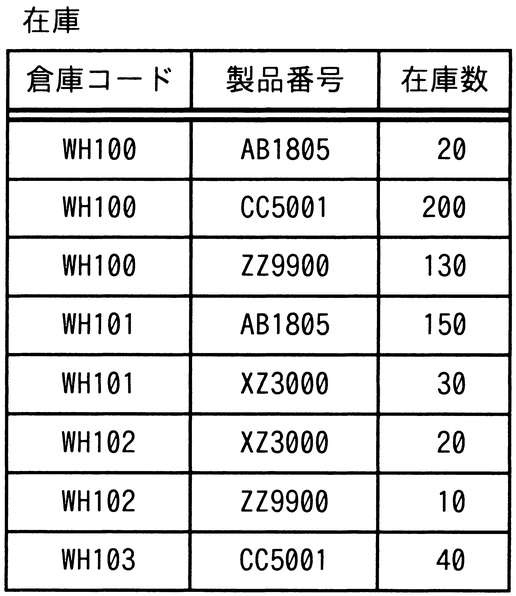

# 令和5年度秋期 問29（技術要素）

## 問題文

“製品”表と“在庫”表に対し，次のSQL文を実行した結果として得られる表の行数は幾つか。

SELECT DISTINCT 製品番号 FROM 製品

　　WHERE NOT EXISTS(SELECT 製品番号 FROM 在庫

　　　　WHERE 在庫数 > 30 AND 製品.製品番号 = 在庫.製品番号)

ア　1

イ　2

ウ　3

エ　4

## 使用画像

## 解答と解説

**正解：イ**

このSQL文は，「在庫数が30を超える在庫レコードが1件も存在しない製品番号」を，製品表からDISTINCTで取得するものである（NOT EXISTS＋在庫数＞30の相関副問合せ）。

“製品”表の5製品それぞれについて，“在庫”表を確認する。

- AB1805：在庫数20（WH100），150（WH101）→150＞30が存在 → 除外
- CC5001：在庫数200（WH100），40（WH103）→200＞30が存在 → 除外
- MZ1000：在庫レコードなし → 在庫数＞30の行は存在しない（NOT EXISTSが真） → 該当
- XZ3000：在庫数30（WH101），20（WH102）→いずれも30以下（30は「＞30」を満たさない） → NOT EXISTSが真 → 該当
- ZZ9900：在庫数130（WH100），10（WH102）→130＞30が存在 → 除外

したがって，条件を満たす製品番号はMZ1000とXZ3000の2件となり，行数は2。イが正しい。

**IPA公式：イ**
