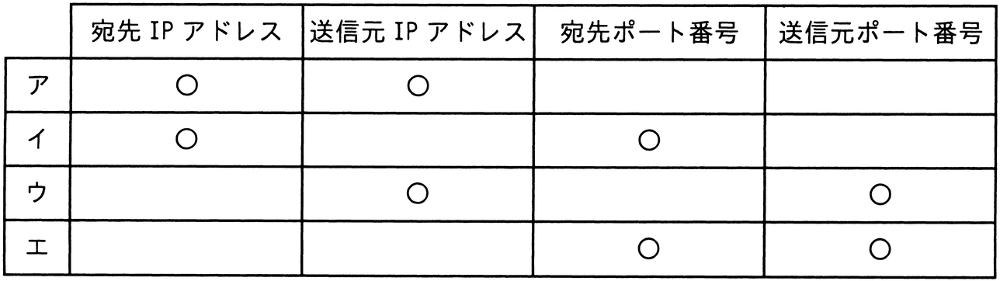

# 令和5年度秋期 問32（技術要素）

## 問題文

プライベートIPアドレスを割り当てられたPCがNAPT（IPマスカレード）機能をもつルータを経由して，インターネット上のWebサーバにアクセスしている。WebサーバからPCへの応答パケットに含まれるヘッダー情報のうち，このルータで書き換えられるフィールドの組合せとして，適切なものはどれか。ここで，表中の○はフィールドの情報が書き換えられることを表す。

## 使用画像

