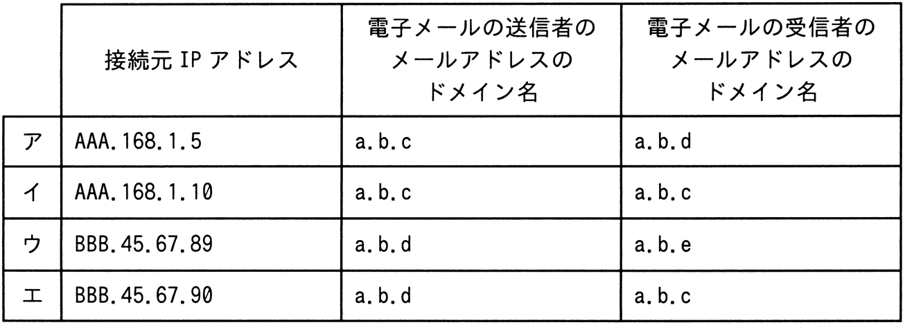

# 令和5年度秋期 問38（技術要素）

## 問題文

自社の中継用メールサーバで，接続元IPアドレス，電子メールの送信者のメールアドレスのドメイン名，及び電子メールの受信者のメールアドレスのドメイン名から成るログを取得するとき，外部ネットワークからの第三者中継と判断できるログはどれか。ここで，AAA.168.1.5とAAA.168.1.10は自社のグローバルIPアドレスとし，BBB.45.67.89とBBB.45.67.90は社外のグローバルIPアドレスとする。a.b.cは自社のドメイン名とし，a.b.dとa.b.eは他社のドメイン名とする。また，IPアドレスとドメイン名は詐称されていないものとする。

## 使用画像

## 解答と解説

**正解：ウ**

第三者中継とは，本来自社に関係のない外部同士（社外から社外へ）の電子メールを，自社のメールサーバが中継してしまう不正利用のことである。第三者中継と判断できるのは，「接続元IPアドレスが社外（自社のグローバルIPアドレスであるAAA.168.1.5，AAA.168.1.10以外）」であり，かつ「送信者・受信者ともに自社ドメイン（a.b.c）を経由していない（送信者・受信者のいずれも他社ドメインである）」ログである。

各選択肢を確認する。

- ア：接続元AAA.168.1.5（自社IP）→自社サーバからの正規の送信であり中継ではない。
- イ：接続元AAA.168.1.10（自社IP）→同様に自社経由の正規のやり取りで，かつ送受信者とも自社ドメインa.b.c。
- ウ：接続元BBB.45.67.89（社外IP）で，送信者ドメインa.b.d，受信者ドメインa.b.eと，いずれも自社ドメイン（a.b.c）を含まない他社同士のメールを中継している → 第三者中継に該当
- エ：接続元BBB.45.67.90（社外IP）だが，受信者ドメインはa.b.c（自社）であり，社外から自社宛のメールを受け取っているだけで中継ではない。

したがって，社外IPアドレスから接続し，送信者・受信者ともに他社ドメイン同士のメールを中継しているウが，第三者中継と判断できるログである。

**IPA公式：ウ**
