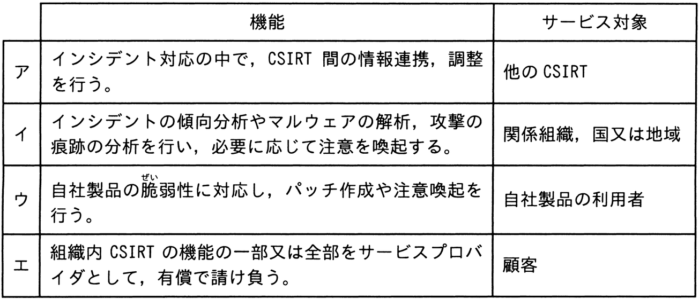

# 令和5年度秋期 問39（技術要素）

## 問題文

JPCERTコーディネーションセンター“CSIRTガイド（2021年11月30日）”では，CSIRTを機能とサービス対象によって六つに分類しており，その一つにコーディネーションセンターがある。コーディネーションセンターの機能とサービス対象の組合せとして，適切なものはどれか。

## 使用画像

## 解答と解説

**正解：ア**

JPCERTコーディネーションセンターの「CSIRTガイド」では，CSIRTを機能とサービス対象によって分類しており，そのうち「コーディネーションセンター」は，自組織自体がインシデント対応の実務を行うのではなく，インシデント対応の中で複数のCSIRT間の情報連携・調整（コーディネーション）を行う役割を担う。サービス対象は「他のCSIRT」である。日本におけるJPCERT/CC自身がこの類型の代表例である。したがって，アが正しい。

- イ：分析センター（アナリシスセンター）の説明。インシデントの傾向分析やマルウェア解析を行い，関係組織・国・地域に注意喚起する。
- ウ：ベンダーチーム（PSIRT）の説明。自社製品の脆弱性に対応し，自社製品の利用者向けにパッチ作成や注意喚起を行う。
- エ：セキュリティオペレーションセンター／MSSPなど，顧客向けにCSIRT機能を有償で提供するサービスプロバイダの説明。

**IPA公式：ア**
