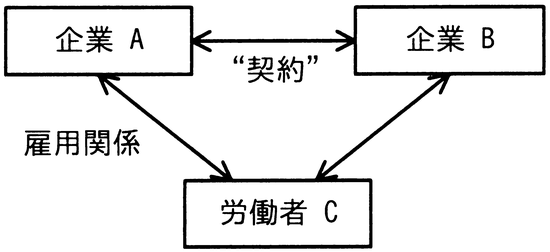

# 令和5年度秋期 問80（ストラテジ）

## 問題文

図は，企業と労働者の関係を表している。企業Bと労働者Cの関係に関する記述のうち，適切なものはどれか。

ア　“契約”が請負契約で，企業Aが受託者，企業Bが委託者であるとき，企業Bと労働者Cとの間には，指揮命令関係が生じる。

イ　“契約”が出向にかかわる契約で，企業Aが企業Bに労働者Cを出向させたとき，企業Bと労働者Cとの間には指揮命令関係が生じる。

ウ　“契約”が労働者派遣契約で，企業Aが派遣元，企業Bが派遣先であるとき，企業Bと労働者Cの間にも，雇用関係が生じる。

エ　“契約”が労働者派遣契約で，企業Aが派遣元，企業Bが派遣先であるとき，企業Bに労働者Cが出向しているといえる。

## 使用画像

図では，企業Aと労働者Cの間に「雇用関係」があり，企業Aと企業Bの間に「"契約"」があり，企業Bと労働者Cの間にも矢印（何らかの関係）が示されている。

## 解答と解説

**正解：イ**

“契約”が出向に関する契約であり，企業Aが企業Bへ労働者Cを出向させた場合，労働者Cは企業Aとの雇用関係（籍）を維持したまま企業Bの指揮命令の下で働くため，出向先である企業Bと労働者Cとの間には指揮命令関係が生じる。これは選択肢イの記述と合致する。

ア について，請負契約では請負元（受託者）が自らの労働者を指揮命令して業務を遂行するため，発注者である委託者（企業B）と労働者Cとの間には指揮命令関係は生じない（誤り）。
ウ・エ について，労働者派遣契約では，派遣元（企業A）が労働者Cと雇用契約を結び，派遣先（企業B）は労働者Cに対して指揮命令のみを行う（雇用関係は生じない）。したがってウの「雇用関係が生じる」は誤りであり，また派遣と出向は法的性質が異なる契約形態であるため，エの「出向しているといえる」も誤りである。

**IPA公式：イ**

