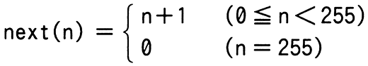

# 令和5年度春期 問1（基礎理論）

## 問題文

0以上255以下の整数nに対して，

　　

と定義する。next（n）と等しい式はどれか。ここで，x AND y及びx OR yは，それぞれxとyを2進数表現にして，桁ごとの論理積及び論理和をとったものとする。

ア　（n＋1） AND 255

イ　（n＋1） AND 256

ウ　（n＋1） OR 255

エ　（n＋1） OR 256

## 使用画像

## 解答と解説

**正解：ア**

next(n)は「0 ≦ n ＜ 255のときはn+1、n=255のときは0」を返す関数、すなわち8ビットの値を1周させるカウンタの更新式である。

- 0 ≦ n ＜ 255（つまりn+1が1〜255の範囲）のとき：(n＋1) AND 255 は、n+1がそのまま255以下なので下位8ビットがそのまま残り、結果はn+1と一致する。
- n＝255のとき：n+1＝256（2進数で100000000）となるが、255（11111111）とのANDをとると全ビットが0になり、結果は0になる。next(255)＝0と一致する。

このように「n+1」と255（＝11111111₂）とのAND演算をとることで、8ビットを超えた桁上がり分（256のビット）が切り捨てられ、0〜255の範囲で折り返す動作を再現できる。よって正解はアである。

- イ：256は100000000₂であり、255以下のn+1とANDをとると常に0になってしまい誤り。
- ウ・エ：OR演算では下位ビットが1に固定されてしまい、n+1の値をそのまま表せないため誤り。

**IPA公式：ア**

