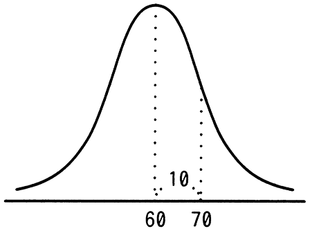
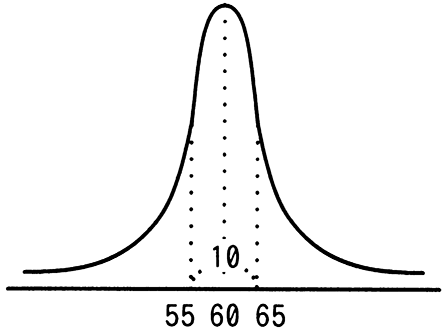
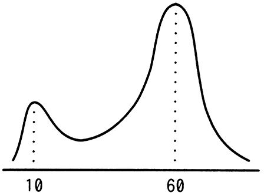
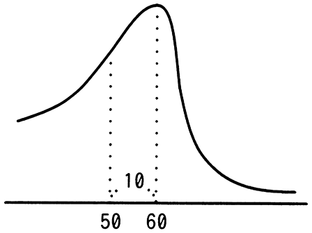

# 令和5年度春期 問2（基礎理論）

## 問題文

平均が60，標準偏差が10の正規分布を表すグラフはどれか。

ア　

イ　

ウ　

エ

## 使用画像

## 解答と解説

**正解：ア**

平均60、標準偏差10の正規分布のグラフは、以下の条件をすべて満たす必要がある。

1. 山の頂点（最頻値＝平均値）がn＝60の位置にある左右対称の釣鐘型（ベル型）曲線であること。
2. 標準偏差10に対応する裾の広がり方であること（極端に尖っていたり、極端に扁平でないこと）。
3. 単峰性（山が一つ）であること。

画像1（AP2023SA002-01.gif）は、60を中心に左右対称な釣鐘型で、60から10離れた70の位置に変曲点相当の目盛りが示されており、平均60・標準偏差10の典型的な正規分布の形状と一致する。よって正解はアである。

- イ：中心は60だが、山が鋭く尖りすぎており、標準偏差10にしては裾が狭すぎる（標準偏差がより小さい分布の形）。
- ウ：山が二つある双峰性の分布であり、正規分布（単峰性）の形状と矛盾する。
- エ：左右非対称な形状であり、正規分布の対称性の条件を満たさない。

**IPA公式：ア**

