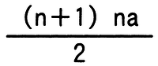
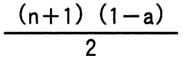
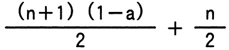
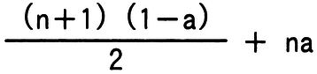

# 令和5年度春期 問6（基礎理論）

## 問題文

従業員番号と氏名の対がn件格納されている表に線形探索法を用いて，与えられた従業員番号から氏名を検索する。この処理における平均比較回数を求める式はどれか。ここで，検索する従業員番号はランダムに出現し，探索は常に表の先頭から行う。また，与えられた従業員番号がこの表に存在しない確率をaとする。

ア　

イ　

ウ　

エ

## 使用画像

