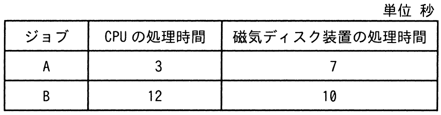
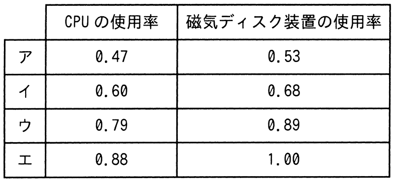

# 令和5年度春期 問14（コンピュータシステム）

## 問題文

CPUと磁気ディスク装置で構成されるシステムで，表に示すジョブA，Bを実行する。この二つのジョブが実行を終了するまでのCPUの使用率と磁気ディスク装置の使用率との組合せのうち，適切なものはどれか。ここで，ジョブA，Bはシステムの動作開始時点ではいずれも実行可能状態にあり，A，Bの順で実行される。CPU及び磁気ディスク装置は，ともに一つの要求だけを発生順に処理する。ジョブA，Bとも，CPUの処理を終了した後，磁気ディスク装置の処理を実行する。

## 使用画像

## 解答と解説

**正解：イ**

各ジョブはCPU処理の後に磁気ディスク処理を行い、CPUもディスクも一度に一つの要求しか処理できない。ジョブはA、Bの順で実行されるため、以下のようにタイムラインを追う。

- ジョブA：CPU処理を時刻0〜3（3秒）で実行。続けてディスク処理を時刻3〜10（7秒）で実行。
- ジョブB：CPUはAの処理が終わる時刻3から使用可能になるため、CPU処理を時刻3〜15（12秒）で実行。ディスクはAの処理が時刻10に終わっているので、Bのディスク処理はBのCPU処理が終わる時刻15から開始し、時刻15〜25（10秒）で実行。

したがって、二つのジョブが終了するまでの全体時間は25秒である。

- CPU使用率：CPUが動作していた時間はA（3秒）＋B（12秒）＝15秒。使用率＝15／25＝0.60
- 磁気ディスク装置使用率：ディスクが動作していた時間はA（7秒）＋B（10秒）＝17秒。使用率＝17／25＝0.68

この値は画像2（AP2023SA014-02.gif）の選択肢イ（CPU使用率0.60、磁気ディスク装置使用率0.68）と一致し、正解はイである。

- ア・ウ・エ：いずれも上記のタイムライン計算（全体時間25秒、CPU稼働15秒、ディスク稼働17秒）と一致しない数値であり誤り。

**IPA公式：イ**

