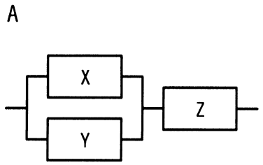
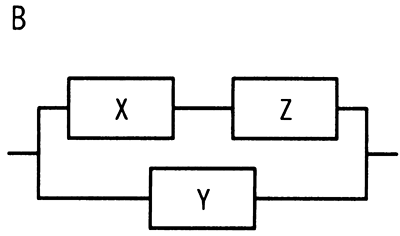

# 令和5年度春期 問16（コンピュータシステム）

## 問題文

3台の装置X〜Zを接続したシステムA，Bの稼働率に関する記述のうち，適切なものはどれか。ここで，3台の装置の稼働率は，いずれも0より大きく1より小さいものとし，並列に接続されている部分は，どちらか一方が稼働していればよいものとする。

ア　各装置の稼働率の値によって，AとBの稼働率のどちらが高いかは変化する。

イ　常にAとBの稼働率は等しい。

ウ　常にAの稼働率はBより高い

エ　常にBの稼働率はAより高い。

## 使用画像

## 解答と解説

**正解：エ**

装置X，Y，Zの稼働率をそれぞれx，y，z（0＜x，y，z＜1）とする。

- システムA：XとYが並列に接続され、その並列部分とZが直列に接続されている。
  RA ＝｛1－(1－x)(1－y)｝× z

- システムB：XとZが直列に接続された経路と、Yの経路が並列に接続されている。
  RB ＝ 1－(1－xz)(1－y)

RBとRAの差を計算すると、

RB－RA ＝｛1－(1－xz)(1－y)｝－｛1－(1－x)(1－y)｝z
　　　＝ xz＋y－xyz－z＋xz＋yz－xyz　（展開して整理）
　　　＝ y(1－z)

x，y，zはいずれも0より大きく1より小さいため、y(1－z)は常に0より大きい正の値になる。すなわちRB－RA＞0であり、RBは常にRAより大きい。これは直感的には、Bの構成ではZの故障がYの経路によって迂回できる（Zが直列に組み込まれているのはXの経路だけで、Yの経路は独立してバックアップになる）のに対し、Aの構成ではZが全体の直列上に位置し、Zが故障すると並列化されたX・Yの冗長性も無意味になってしまう、という違いに起因する。

したがって、装置の稼働率の値によらず常にBの稼働率がAより高く、正解はエである。

- ア：上記のとおり、xyzの値によらず常にRB＞RAとなる関係が数学的に導けるため、「値によって変化する」は誤り。
- イ：RB－RA＝y(1－z)＞0より、常に差があり、等しくなることはないため誤り。
- ウ：常に高いのはAではなくBであるため誤り。

**IPA公式：エ**

