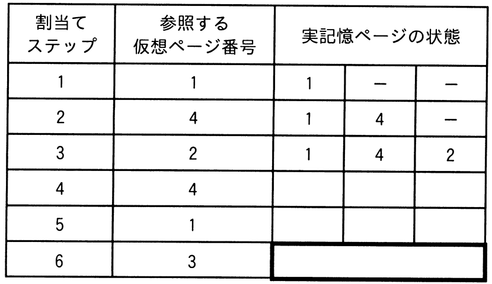
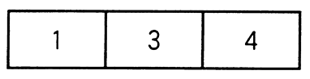
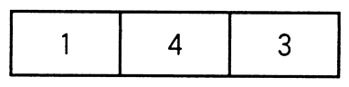
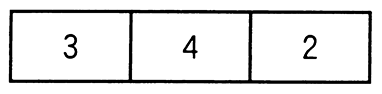
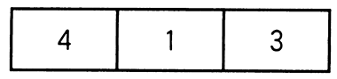

# 令和5年度春期 問17（コンピュータシステム）

## 問題文

仮想記憶システムにおいて，ページ置換えアルゴリズムとしてFIFOを採用して，仮想ページ参照列1，4，2，4，1，3を3ページ枠の実記憶に割り当てて処理を行った。表の割当てステップ“3”までは，仮想ページ参照列中の最初の1，4，2をそれぞれ実記憶に割り当てた直後の実記憶ページの状態を示している。残りを全て参照した直後の実記憶ページの状態を示す太枠部分に該当するものはどれか。

ア　

イ　

ウ　

エ

## 使用画像

