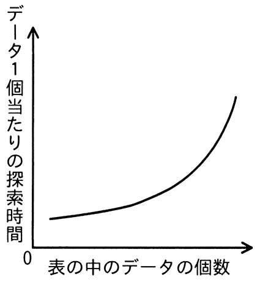
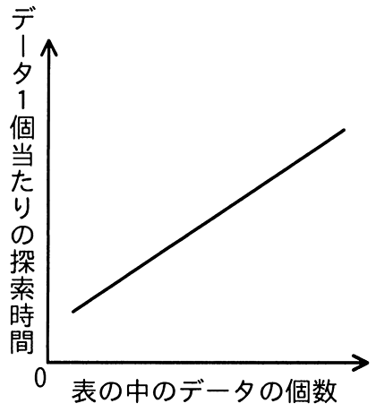
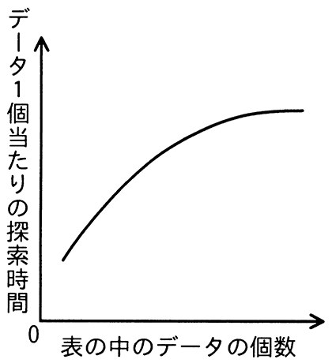
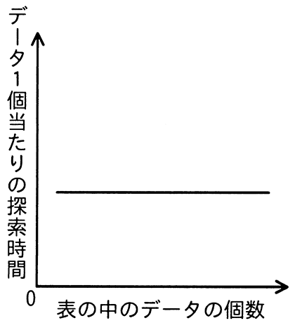

# 令和5年度春期 問19（基礎理論）

## 問題文

ハッシュ表の理論的な探索時間を示すグラフはどれか。ここで，複数のデータが同じハッシュ値になることはないものとする。

ア　

イ　

ウ　

エ

## 使用画像

## 解答と解説

**正解：エ**

ハッシュ法は、探索対象のキーからハッシュ関数によって直接、格納位置（アドレス）を計算し、その位置を参照してデータにアクセスする探索方式である。問題文の条件「複数のデータが同じハッシュ値になることはない（衝突が発生しない）」の下では、どのデータであってもハッシュ関数の計算とその位置への直接アクセスだけで探索が完了する。

この場合、探索に必要な時間はハッシュ関数の計算コストとメモリアクセスのコストのみに依存し、表に格納されているデータの個数（表の大きさ）が増えても、1個当たりの探索時間は変化しない。つまり、理論上のハッシュ表の探索時間はデータ件数によらず一定（O(1)）となる。

この特性はグラフ上で「データの個数によらず横軸に対して水平な直線」として表される。画像4（AP2023SA019-04.gif）がこれに該当し、正解はエである。

- ア：データ件数の増加とともに探索時間が急激に増加する曲線であり、衝突が発生する場合の性能劣化などを示す形状に近く、衝突なしの理論値としては誤り。
- イ：データ件数に比例して探索時間が増加する直線であり、線形探索法の特性に近く、ハッシュ法の理論値としては誤り。
- ウ：データ件数の増加に伴い増加率が徐々に緩やかになる曲線であり、対数的な増加を示す形状（2分探索など）に近く、ハッシュ法（定数時間）の理論値としては誤り。

**IPA公式：エ**

