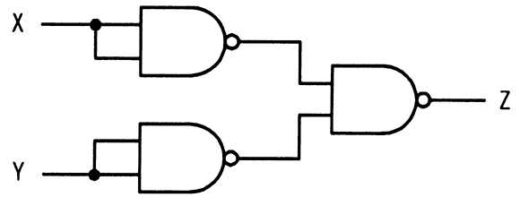

# 令和5年度春期 問21（コンピュータシステム）

## 問題文

NAND素子を用いた次の組合せ回路の出力Zを表す式はどれか。ここで，論理式中の“・”は論理積，“＋”は論理和，“X̅”はXの否定を表す。

ア　X・Y

イ　X＋Y

ウ　X̅・̅Y̅

エ　X̅＋̅Y̅

## 使用画像

## 解答と解説

**正解：イ**

回路図はX，Yをそれぞれ2入力の同一信号としてNAND素子に入力し，その2つのNAND出力をさらにNAND素子に入力する構成である。

- 上段のNAND：入力がX，Xなので出力は NAND(X,X) = (X・X)の否定 = Xの否定（X）
- 下段のNAND：同様に出力は NAND(Y,Y) = Yの否定（Y）
- 最終段のNAND：入力がX，Yなので，出力Z = (X・Y)の否定

ここでド・モルガンの法則より，(X・Y)の否定 = X＋Y（Xの否定否定＝X，Yの否定否定＝Yより）となる。すなわち Z = X＋Y であり，選択肢イと一致する。

アとウは否定なしのX・Y，X・Yであり論理積の形なので誤り。エはX＋Y（否定付きの和）であり，実際の展開結果と符号が異なるため誤り。

**IPA公式：イ**

