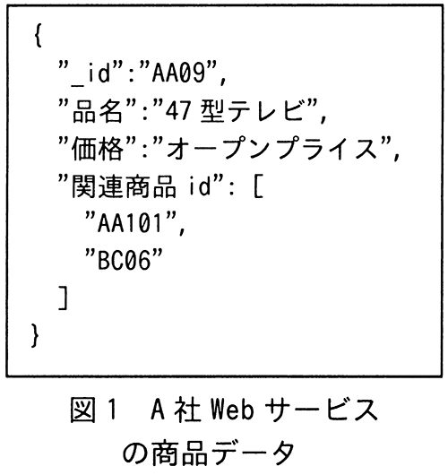
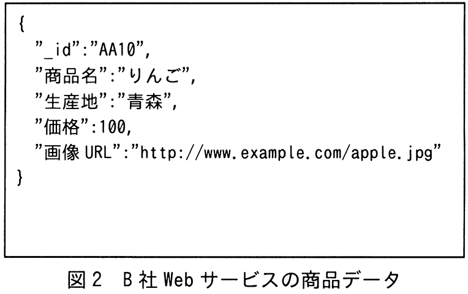

# 令和5年度春期 問26（技術要素）

## 問題文

JSON形式で表現される図1，図2のような商品データを複数のWebサービスから取得し，商品データベースとして蓄積する際のデータの格納方法に関する記述のうち，適切なものはどれか。ここで，商品データの取得元となるWebサービスは随時変更され，項目数や内容は予測できない。したがって，商品データベースの検索時に使用するキーにはあらかじめ制限を設けない。

ア　階層型データベースを使用し，項目名を上位階層とし，値を下位階層とした2階層でデータを格納する。

イ　グラフデータベースを使用し，商品データの項目名の集合から成るノードと値の集合から成るノードを作り，二つのノードを関係付けたグラフとしてデータを格納する。

ウ　ドキュメントデータベースを使用し，項目構成の違いを区別せず，商品データ単位にデータを格納する。

エ　関係データベースを使用し，商品データの各項目名を個別の列名とした表を定義してデータを格納する。

## 使用画像

## 解答と解説

**正解：ウ**

図1（A社の商品データ：_id，品名，価格，関連商品idの配列）と図2（B社の商品データ：_id，商品名，生産地，価格，画像URL）を見ると，取得元Webサービスによって項目名も項目数も異なっている。問題文にも「項目数や内容は予測できない」「検索キーにあらかじめ制限を設けない」とあるため，スキーマ（表構造）を事前に固定できないデータ形式に対応する必要がある。

ドキュメントデータベース（例：MongoDBなど）は，JSON（あるいはBSON）のようなキーと値の集合をそのままドキュメント単位で格納でき，ドキュメントごとに異なる項目構成を許容する。そのため，商品データを個々のドキュメントとしてそのまま蓄積できる選択肢ウが適切である。

- ア：階層型データベースは事前に決められた階層構造（親子関係）を前提とするため，項目構成が予測できないデータには不向き。
- イ：グラフデータベースはノードとエッジによる関係性の表現に適したモデルであり，単純な商品データの属性格納には過剰かつ不自然な設計である。
- エ：関係データベースで項目名を列名として定義するには，事前にスキーマ（列構成）を固定する必要があり，項目数や内容が予測できないという条件に反する。

**IPA公式：ウ**

